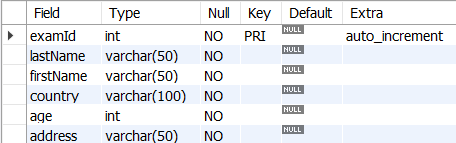

# DDL(Data Definition Language)
    데이터의 기본 구조 및 형식 변경
- SQL 키워드
    - CREATE
    - DROP
    - ALTER

## 1. CREATE
    CREATE TABLE statement : 테이블 생성

## CREATE TABLE sytax
```sql
CREATE TABLE table_name (
    column_1 data_type,
    column_2 data_type,
    ...,
    constraints
);
```
- 각 필드에 적용할 데이터 타입(data type) 작성
- 테이블 및 필드에 대한 제약조건(constraints) 작성

## CREATE TABLE example
```sql
CREATE TABLE examples (
	examId INT AUTO_INCREMENT,
    lastName VARCHAR(50) NOT NULL,
    firstName VARCHAR(50) NOT NULL,
    PRIMARY KEY (examId)
); 

-- Table 구조 확인
SHOW COLUMNS FROM examples;
```


### CREATE TABLE 살펴보기
- 데이터 타입
    - INT
        - 숫자형
    - VARCHAR(50)
        - 문자형
- 제약 조건(Constraint) : 데이터 **무결성**을 지키기 위해 테이터를 입력 받을 때 실행하는 검사 규칙
    - NOT NULL
        - 해당 필드에 NULL 값을 저장하지 못하도록 지정
    - PRIMARY KEY
        - 해당 필드를 기본 키로 지정
- 속성
    - AUTO_INCREMENT
        - 테이블의 기본 키에 대한 번호 자동 생성

#### AUTO_INCREMENT 특징
- 기본 키 필드에 사용
    - 고유한 숫자를 부여
- 시작 값은 1이며 데이터 입력 시 값을 생략하면 자동으로 1씩 증가
- 이미 사용한 값을 재사용하지 않음
- 기본적으로 NOT NULL 제약 조건을 포함

## 2. DELETE
    DROP TABLE statement : 테이블 삭제

## DROP TABLE syntax
```sql
DROP TABLE table_name;
```
- DROP TABLE statement 이후 삭제할 테이블 이름 작성

## DROP TABLE examples
- 테이블을 삭제
```sql
DROP TABLE examples;
```

## 3. ALTER
    ALTER TABLE statement : 테이블 필드 조작(생성, 수정, 삭제)
- ALTER TABLE ADD : 필드 추가
- ALTER TABLE MODIFY : 필드 속성 변경
- ALTER TABLE CHANGE COLUMN : 필드 이름 변경
- ALTER TABLE DROP COLUMN : 필드 삭제

## ALTER TABLE ADD syntax
```sql
ALTER TABLE
    table_name
ADD
    new_cloumn_name cloumn_definition;
```
- ADD 키워드 이후 추가하고자 하는 새 필드 이름과 데이터 타입 및 제약 조건 작성


### ALTER TABLE ADD 예시

```sql
-- 예시 테이블 생성

CREATE TABLE examples (
	examId INT AUTO_INCREMENT,
    lastName VARCHAR(50) NOT NULL,
    firstName VARCHAR(50) NOT NULL,
    PRIMARY KEY (examId)
);
```

1.  examples 테이블에 country 필드 추가
    - 단, country 필드는 가변길이 문자열 최대 100자이며 NULL값을 허용하지 않음
```sql
-- 필드 한 개 생성

ALTER TABLE 
	examples 
ADD 
	country VARCHAR(100) NOT NULL;
```


2.  examples 테이블에 age와 address 필드 추가
    - age 필드는 정수 타입이 저장되며 NULL값을 허용하지 않음
    - address 필드는 가별길이 문자열 최대 100자이며 NULL값을 허용하지 않음
```sql
-- 필드 여러 개 생성

ALTER TABLE 
	examples 
ADD 
	age INT NOT NULL,
ADD
    address VARCHAR(100) NOT NULL;
```


## ALTER TABLE MODIFY syntax
```sql
ALTER TABLE
    table_name
MODIFY
    column_name column_definition;
```
- MODIFY 키워드 이후 변경하고자 하는 필드 이름과 데이터 타입 및 제약 조건 작성

### ALTER TABLE MODIFY 예시

1. examples 테이블에 address 필드를 가변길이 문자열 최대 50자까지, NULL값을 허용하지 않도록 변경
```sql
-- 필드 한 개 수정

ALTER TABLE
	examples
MODIFY
	address VARCHAR(50) NOT NULL;
```


2. examples 테이블의 lastName, firstName 필드를 가변길이 문자열 최대 10자까지, NULL값을 허용하지 않도록 변경
```sql
-- 필드 여러 개 수정

ALTER TABLE
	examples
MODIFY
	lastName VARCHAR(10) NOT NULL,
MODIFY
    firstName VARCHAR(10) NOT NULL;
```


## ALTER TABLE CHANGE CLOUMN syntax
```sql
ALTER TABLE
    table_name
MODIFY
    original_name column_name column_definition;
```
- CHANGE CLOUMN 키워드 이후 기존 필드 이름, 변경하고자 하는 필드 이름 그리고 데이터 타입 및 제약조건 작성

### ALTER TABLE CHANGE CLOUMN 예시

1.  examples 테이블의 country 필드 이름을 state로 변경
    - 단, 데이터 타입 및 제약 조건은 기존과 동일
```sql
ALTER TABLE
	examples
CHANGE COLUMN
	country state VARCHAR(100) NOT NULL;
```


## ALTER TABLE DROP COLUMN syntax
```sql
ALTER TABLE
    table_name
DROP COLUMN
    column_name;
```
- DROP COLUMN 키워드 이후 삭제하고자 하는 필드 이름 작성

### ALTER TABLE DROP COLUMN 예시
1. examples 테이블의 adress 필드 삭제
```sql
-- 필드 한 개 삭제

ALTER TABLE
	examples
DROP COLUMN
	address;
```


2. examples 테이블의 state와 age 필드 삭제
```sql
-- 필드 여러 개 삭제

ALTER TABLE
	examples
DROP COLUMN
	state,
DROP COLUMN
    age;
```


### 참고
- 반드시 NOT NULL 제약을 사용해야 할까?
    - 'NO'
    - 데이터베이스를 사용하는 프로그램에 따라 NULL을 저장할 필요가 없는 경우가 많으므로 되도록 NOT NULL로 정의
    - '값이 없다.'라는 표현을 테이블에 기록하는 것은 0이나 빈 문자열 등을 사용하는 것으로 대체하는 것을 권장