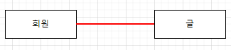
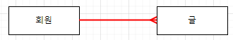
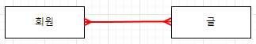
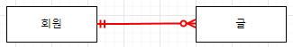

# 1. Transaction
    - 여러 쿼리문을 묶어서 하나의 작업처럼 처리하는 방법
    - 단, 다 성공 또는 실패를 해야 함

## Transaction 예시
- 계좌이체 (인출 & 입금)
    - 송금 중에 알 수 없는 문제로 인출에는 성공했는 데 입금에 실패한다면?
    - 인출과 입금 모두 성공적으로 끝나야 거래가 최종 승인되고, 중간에 문제가 발생한다면 거래를 처음부터 없었던 거래로 만들어야 함
    - 결국 함께 성공하던지 실패해야 함

## Transactions Syntax
```sql
START TRANSACTION;
state_ments;
...
[ROLLBACK|COMMIT];
```
- START TRANSACTION
    - 트랜잭션 구문의 시작을 알림
- COMMIT
    - 모든 작업이 정상적으로 완료되면 한꺼번에 DB에 반영
- ROLLBACK
    - 부분적으로 작업이 실패하면 트랜잭션에서 진행한 모든 연산을 취소하고 트랜잭션 실행 전으로 되돌림

## Transaction 원리
```sql
START TRANSACTION;
INSERT INTO ... -- INSERT INTO : 임시 데이터 영역
INSERT INTO ...
```
- 임시 데이터 영역
    - COMMIT이 이뤄지면 영구 데이터 영역이 됨
    - ROLLBACK이 이뤄지면 임시 데이터 영역이 파기됨

## Transaction 예제
- 기본적으로 MySQL은 자동으로 변경 사항을 COMMIT함
- 변경 사항을 자동으로 COMMIT 하지 않도록 다음과 같이 설정
```sql
-- 자동 COMMIT 비활성화
SET autocommit = 0;

-- users 테이블 생성
CREATE TABLE users(
    id INT AUTO_INCREMENT,
    name VARCHAR(10) NOT NULL,
    PRIMARY KEY (id)
);
```
- 트랜잭션을 사용해 users 테이블에 데이터를 삽입하고 ROLLBACK을 했을 때와 COMMIT을 했을 때 users 테이블의 상태를 비교
```sql
-- ROLLBACK
START TRANSACTION;

INSERT INTO users (name)
VALUES ('james'), ('mary');

SELECT * FROM users;

ROLLBACK;

SELECT * FROM users;
```


```sql
-- COMMIT
START TRANSACTION;

INSERT INTO users (name)
VALUES ('james'), ('mary');

SELECT * FROM users;

COMMIT;

SELECT * FROM users;
```


## Transaction 정리
- 쪼개질 수 없는 업무처리의 단위
- 전체가 수행되거나 또는 전혀 수행되지 않아야 함 (All or Nothing)

# 2. Triggers
    - 특정 이벤트에 대한 응답으로 자동으로 실행되는 것
    - 특정 이벤트 : INSERT, UPDATE, DELETE
    - ~를 추가한 후에 ~ 하겠다.
    - ~를 수정한 후에 ~ 하겠다.
    - ~를 삭제한 후에 ~ 하겠다.
        - ~ 하겠다 => Trigger

## Triggers syntax
```sql
CREATE TRIGGER trigger_name
{BEFORE | AFTER} {INSERT | UPDATE | DELETE}
ON table_name FOR EACH ROW
trigger_body;
```
- CREATE TRIGGER 키워드 다음에 생성하려는 트리거의 이름을 지정
- 각 레코드의 어느 시점에 트리거가 실행될지 지정 (삽입, 수정, 삭제 전/후)
- ON 키워드 뒤에 트리거가 속한 테이블의 이름을 지정
- 트리거가 활성화될 때 실행할 코드를 trigger_body에 지정
    - 여러 명령문을 실행하려면 BEGIN END 키워드로 묶어서 사용
- 트리거는 DML(데이터 조작)의 영향을 받는 필드 값에만 적용할 수 있음

## Triggers 예제
- 트리거를 사용해 기존 게시글이 수정되면, 게시글의 수정일자 필드 값을 최신 일자로 업데이트하기
```sql
-- 사전 준비 / articles 테이블 작성 및 예시 데이터 입력

CREATE TABLE articles(
	id INT AUTO_INCREMENT,
    title VARCHAR(100) NOT NULL,
    createdAt DATETIME NOT NULL,
    updatedAt DATETIME NOT NULL,
    PRIMARY KEY (id)
);

INSERT INTO articles (title, createdAt, updatedAt)
VALUES ('title1', CURRENT_TIME(), CURRENT_TIME());
```

- 트리거를 사용해 기존 게시글이 수정되면, 게시글의 수정일자 필드 겂을 최신 일자로 업데이트하기
```sql
DELIMITER // -- // 자리에 커스텀 가능 (/ 하나로도 가능)
CREATE TRIGGER myTrigger
	-- 언제 수정이 될 것인가?
    BEFORE UPDATE
    ON articles FOR EACH ROW
BEGIN -- trigger body가 여러 개일 때, 하나로 묶어주기 위해 사용됨(body가 하나여도 적어두는게 좋음)
    SET NEW.updatedAt = CURRENT_TIME(); -- trigger body
END//
DELIMITER ;
```
- SQL의 구문 문자(;)를 변경
- BEGIN - END 구문 사이에 여러 SQL 문이 작성되기 때문에 하나의 트리거로써 작동될 수 있도록 사용
- SET 다음 트리거에서 특점 시점 전/후의 값에 접근 할 수 있도록 제공하는 키워드
    - OLD 와 NEW 2개 제공
        - 상황별로 사용할 수 있는 여부

            |  | OLD | NEW |
            |:---:|:---:|:---:|
            | INSERT | NO | YES |
            | UPDATE | YES | YES |
            | DELETE | YES | NO |

## Trigger 관련 추가 명령문
```sql
-- 트리거 목록 확인
SHOW TRIGGERS;

-- 트리거 삭제
DROP TRIGGER trigger_name;
```

## Triggers 생성 시 에러 해결
- 트랜잭션 생성 후 정상 적으로 종료되지 않아 발생하는 에러 발생 시 해결법
- Error Code:2013. Lost connection to MySQL server during query
- Error Code:2015. Lock wait timeout exceeded; try restarting transaction
```sql
-- 실행중인 프로세스 목록 확인
SELECT * FROM information_schema.INNODB_TRX;

-- 특정 프로세스의 trx_mysql_thread_id 삭제
KILL [trx_mysql_thread_id1];
```

# 3. Normalization(정규화)
    - RDB 설계 단계에서 중복을 최소화하여 데이터를 구조화하는 과정
    - 데이터를 구조화하다 : 크고, 제대로 조직되지 않은 테이블들과 관계들을 작고 잘 조직된 테이블과 관계들로 나누는 것

## 제 1 ~ 3 정규화 진행
- 아래 테이블을 예시로 정규화 진행

| 주문번호 | 날짜 | 이름 | 연락처 | 주문상품 |
|:---:|:---:|:---:|:---:|:---:|
| 1 | 1/5 | 영자 | 010-XXX | 0001 책상 1개, 0002 시계 10개 |
| 2 | 2/1 | 혜지 | 017-XXX | 0001 책상 2개, 0002 시계 3개 |
| 3 | 2/5 | 영자 | 010-XXX | 0001 책상 3개, 0003 가위 1개 |

---

## 제 1 정규화
- 데이터베이스의 각 필드에는 하나의 값만 저장해야 함
- 유사하게 정보를 저장하는 두 개의 필드가 있어서는 안됨
    - 반복되는 부분을 찾아 테이블을 분할하고 기본키가 될 필드를 작성

| 주문번호 | 날짜 | 이름 | 연락처 | 주문상품 |
|:---:|:---:|:---:|:---:|:---:|
| 1 | 1/5 | 영자 | 010-XXX | 0001 책상 1개, 0002 시계 10개 |
| 2 | 2/1 | 혜지 | 017-XXX | 0001 책상 2개, 0002 시계 3개 |
| 3 | 2/5 | 영자 | 010-XXX | 0001 책상 3개, 0003 가위 1개 |

- 주문번호 1번, 3번의 영자는 동일 인물이다.

### [1 - 1]
| 주문번호 | 날짜 | 이름 | 연락처 | 상품코드 | 상품명 | 개수 |
|:---:|:---:|:---:|:---:|:---:|:---:|:---:|
| 1 | 1/5 | 영자 | 010-XXX | 0001 | 책상 | 1 |
| 1 | 1/5 | 영자 | 010-XXX | 0002 | 시계 | 10 |
| 2 | 2/1 | 혜지 | 017-XXX | 0001 | 책상 | 2 |
| 2 | 2/1 | 혜지 | 017-XXX | 0002 | 시계 | 3 |
| 3 | 2/5 | 영자 | 010-XXX | 0001 | 책상 | 3 |
| 3 | 2/5 | 영자 | 010-XXX | 0003 | 가위 | 1 |

- 주문상품을 3개의 필드로 분할

### [1 - 2]
- 주문 테이블과 주문상품 테이블 2개의 테이블로 분할

### 주문 테이블
| 주문번호 | 날짜 | 이름 | 연락처 |
|:---:|:---:|:---:|:---:|
| 1 | 1/5 | 영자 | 010-XXX |
| 2 | 2/1 | 혜지 | 017-XXX |
| 3 | 2/5 | 영자 | 010-XXX |

### 주문상품 테이블
| 주문번호 | 상품코드 | 상품명 | 개수 |
|:---:|:---:|:---:|:---:|
| 1 | 0001 | 책상 | 1 |
| 1 | 0002 | 시계 | 10 |
| 2 | 0001 | 책상 | 2 |
| 2 | 0002 | 시계 | 3 |
| 3 | 0001 | 책상 | 3 |
| 3 | 0003 | 가위 | 1 |

---

## 제 2 정규화
- 키 값을 이용해 데이터를 특정 지을 수 있는 것(함수 종속성)을 찾아 테이블을 분할

### 주문상품 테이블
- 상품명은 상품코드에 종속적

| 주문번호 | 상품코드 | 상품명 | 개수 |
|:---:|:---:|:---:|:---:|
| 1 | 0001 | 책상 | 1 |
| 1 | 0002 | 시계 | 10 |
| 2 | 0001 | 책상 | 2 |
| 2 | 0002 | 시계 | 3 |
| 3 | 0001 | 책상 | 3 |
| 3 | 0003 | 가위 | 1 |


### [2 - 1]
### 주문상품 테이블

| 주문번호 | 상품코드 | 개수 |
|:---:|:---:|:---:|
| 1 | 0001 | 1 |
| 1 | 0002 | 10 |
| 2 | 0001 | 2 |
| 2 | 0002 | 3 |
| 3 | 0001 | 3 |
| 3 | 0003 | 1 |

### 상품 테이블

| 상품코드 | 상품명 |
|:---:|:---:|
| 0001 | 책상 | 
| 0002 | 시계 |
| 0001 | 책상 | 

- '상품코드'라는 키 값을 통해 상품이라는 데이터를 특정 지을 수 있음

---

## 제 3 정규화
- 기본 키 이외의 부분에서 중복이 없는 지를 조사하여 테이블을 분할

### [3 - 1]
### 주문 테이블
| 주문번호 | 날짜 | 이름 | 연락처 |
|:---:|:---:|:---:|:---:|
| 1 | 1/5 | 영자 | 010-XXX |
| 2 | 2/1 | 혜지 | 017-XXX |
| 3 | 2/5 | 영자 | 010-XXX |

### 주문상품 테이블
| 주문번호 | 상품코드 | 개수 |
|:---:|:---:|:---:|
| 1 | 0001 | 1 |
| 1 | 0002 | 10 |
| 2 | 0001 | 2 |
| 2 | 0002 | 3 |
| 3 | 0001 | 3 |
| 3 | 0003 | 1 |

### 상품 테이블
| 상품코드 | 상품명 |
|:---:|:---:|
| 0001 | 책상 | 
| 0002 | 시계 |
| 0001 | 책상 |

- 주문 테이블에서 '영자'가 같은 사람으로 반복해서 주문

---
### [3 - 2]
- 주문 테이블을 주문 테이블과 고객 테이블로 분할

### 주문 테이블
| 주문번호 | 날짜 | 고객번호 |
|:---:|:---:|:---:|
| 1 | 1/5 | 1 |
| 2 | 2/1 | 2 |
| 3 | 2/5 | 1 |

### 고객 테이블
| 고객번호 | 이름 | 연락처 |
|:---:|:---:|:---:|
| 1 | 영자 | 010-XXX |
| 2 | 혜지 | 017-XXX |

---

## 정규화 결과

### 주문 테이블
| 주문번호 | 날짜 | 고객번호 |
|:---:|:---:|:---:|
| 1 | 1/5 | 1 |
| 2 | 2/1 | 2 |
| 3 | 2/5 | 1 |

### 고객 테이블
| 고객번호 | 이름 | 연락처 |
|:---:|:---:|:---:|
| 1 | 영자 | 010-XXX |
| 2 | 혜지 | 017-XXX |

### 주문상품 테이블
| 주문번호 | 상품코드 | 개수 |
|:---:|:---:|:---:|
| 1 | 0001 | 1 |
| 1 | 0002 | 10 |
| 2 | 0001 | 2 |
| 2 | 0002 | 3 |
| 3 | 0001 | 3 |
| 3 | 0003 | 1 |

### 상품 테이블
| 상품코드 | 상품명 |
|:---:|:---:|
| 0001 | 책상 | 
| 0002 | 시계 |
| 0001 | 책상 |

---

## 정규화 목적
- '데이터를 쉽게 관리하기 위해'
    - 하나의 데이터를 무조건 한 곳에만 위치하도록
    - 테이블 간의 관게는 키를 통해 생성
    - 데이터를 변경하더라도 한 곳만 변경하는 구조 확립


# 4. Data Modeling
    - 데이터베이스 시스템을 시각적으로 표현하는 프로세스
    - 데이터 유형, 데이터 간의 관계 및 분석 등을 통해 비즈니스 요구사항을 만들어 낼 수 있도록 도움

## ER(Entity - Relationship) Diagram
- 다이어그램을 사용하여 데이터베이스의 Entity 간 관계를 나타내는 방법

## ER Diagram 구성 요소
1. Entity -> Table
2. Attribute -> Field
3. Relation -> PK, FK

## Relationship 표현 방법
- Cardinality & Optionality
    - Cardinality -> 1 : 1, N : 1, N : M
    - Optionality -> 필수 & 선택

- Cardinality(기수)
    - 1 : 1 관계

        
    
    - N : 1 관계

        

     - N : M 관계

        

- Optionality (선택 가능성)
    - 1 : N 관계라면 회원은 '필수', 글은 '선택'

        

### Cardinality와 Optionality을 조합
- '하나의 회원은 여러 개의 글을 작성할 수 있고, 하나의 글은 한 명의 회원이 작성할 수 있다.'
- 회원과 글의 관계는 **1 : N**이며, 글은 **필수적**으로 회원과 연결되어야 하지만, 회원은 **선택적**으로 글과 연결될 수 있는 관계

## 데이터 모델링의 중요성
- 데이터베이스 소프트웨어 개발 오류 감소
- 데이터베이스 설계 및 생성 속도와 효율성 촉진
- 조직 전체에서 데이터 문서화 및 시스템 설계의 일관성 조성
- 데이터 엔지니어와 비즈니스 팀 간의 커뮤니테이션 촉진