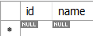
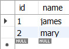

# 1. Transaction
    - 여러 쿼리문을 묶어서 하나의 작업처럼 처리하는 방법
    - 단, 다 성공 또는 실패를 해야 함

## Transaction 예시
- 계좌이체 (인출 & 입금)
    - 송금 중에 알 수 없는 문제로 인출에는 성공했는 데 입금에 실패한다면?
    - 인출과 입금 모두 성공적으로 끝나야 거래가 최종 승인되고, 중간에 문제가 발생한다면 거래를 처음부터 없었던 거래로 만들어야 함
    - 결국 함께 성공하던지 실패해야 함

## Transactions Syntax
```sql
START TRANSACTION;
state_ments;
...
[ROLLBACK|COMMIT];
```
- START TRANSACTION
    - 트랜잭션 구문의 시작을 알림
- COMMIT
    - 모든 작업이 정상적으로 완료되면 한꺼번에 DB에 반영
- ROLLBACK
    - 부분적으로 작업이 실패하면 트랜잭션에서 진행한 모든 연산을 취소하고 트랜잭션 실행 전으로 되돌림

## Transaction 원리
```sql
START TRANSACTION;
INSERT INTO ... -- INSERT INTO : 임시 데이터 영역
INSERT INTO ...
```
- 임시 데이터 영역
    - COMMIT이 이뤄지면 영구 데이터 영역이 됨
    - ROLLBACK이 이뤄지면 임시 데이터 영역이 파기됨

## Transaction 예제
- 기본적으로 MySQL은 자동으로 변경 사항을 COMMIT함
- 변경 사항을 자동으로 COMMIT 하지 않도록 다음과 같이 설정
```sql
-- 자동 COMMIT 비활성화
SET autocommit = 0;

-- users 테이블 생성
CREATE TABLE users(
    id INT AUTO_INCREMENT,
    name VARCHAR(10) NOT NULL,
    PRIMARY KEY (id)
);
```
- 트랜잭션을 사용해 users 테이블에 데이터를 삽입하고 ROLLBACK을 했을 때와 COMMIT을 했을 때 users 테이블의 상태를 비교
```sql
-- ROLLBACK
START TRANSACTION;

INSERT INTO users (name)
VALUES ('james'), ('mary');

SELECT * FROM users;

ROLLBACK;

SELECT * FROM users;
```


```sql
-- COMMIT
START TRANSACTION;

INSERT INTO users (name)
VALUES ('james'), ('mary');

SELECT * FROM users;

COMMIT;

SELECT * FROM users;
```


## Transaction 정리
- 쪼개질 수 없는 업무처리의 단위
- 전체가 수행되거나 또는 전혀 수행되지 않아야 함 (All or Nothing)

# 2. Triggers
    - 특정 이벤트에 대한 응답으로 자동으로 실행되는 것
    - 특정 이벤트 : INSERT, UPDATE, DELETE
    - ~를 추가한 후에 ~ 하겠다.
    - ~를 수정한 후에 ~ 하겠다.
    - ~를 삭제한 후에 ~ 하겠다.
        - ~ 하겠다 => Trigger

## Triggers syntax
```sql
CREATE TRIGGER trigger_name
{BEFORE | AFTER} {INSERT | UPDATE | DELETE}
ON table_name FOR EACH ROW
trigger_body;
```
- CREATE TRIGGER 키워드 다음에 생성하려는 트리거의 이름을 지정
- 각 레코드의 어느 시점에 트리거가 실행될지 지정 (삽입, 수정, 삭제 전/후)
- ON 키워드 뒤에 트리거가 속한 테이블의 이름을 지정
- 트리거가 활성화될 때 실행할 코드를 trigger_body에 지정
    - 여러 명령문을 실행하려면 BEGIN END 키워드로 묶어서 사용
- 트리거는 DML(데이터 조작)의 영향을 받는 필드 값에만 적용할 수 있음

## Triggers 예제
- 트리거를 사용해 기존 게시글이 수정되면, 게시글의 수정일자 필드 값을 최신 일자로 업데이트하기
```sql
-- 사전 준비 / articles 테이블 작성 및 예시 데이터 입력

CREATE TABLE articles(
	id INT AUTO_INCREMENT,
    title VARCHAR(100) NOT NULL,
    createdAt DATETIME NOT NULL,
    updatedAt DATETIME NOT NULL,
    PRIMARY KEY (id)
);

INSERT INTO articles (title, createdAt, updatedAt)
VALUES ('title1', CURRENT_TIME(), CURRENT_TIME());
```

- 트리거를 사용해 기존 게시글이 수정되면, 게시글의 수정일자 필드 겂을 최신 일자로 업데이트하기
```sql
DELIMITER // -- // 자리에 커스텀 가능 (/ 하나로도 가능)
CREATE TRIGGER myTrigger
	-- 언제 수정이 될 것인가?
    BEFORE UPDATE
    ON articles FOR EACH ROW
BEGIN -- trigger body가 여러 개일 때, 하나로 묶어주기 위해 사용됨(body가 하나여도 적어두는게 좋음)
    SET NEW.updatedAt = CURRENT_TIME(); -- trigger body
END//
DELIMITER ;
```
- SQL의 구문 문자(;)를 변경
- BEGIN - END 구문 사이에 여러 SQL 문이 작성되기 때문에 하나의 트리거로써 작동될 수 있도록 사용
- SET 다음 트리거에서 특점 시점 전/후의 값에 접근 할 수 있도록 제공하는 키워드
    - OLD 와 NEW 2개 제공
        - 상황별로 사용할 수 있는 여부

            |  | OLD | NEW |
            |:---:|:---:|:---:|
            | INSERT | NO | YES |
            | UPDATE | YES | YES |
            | DELETE | YES | NO |

## Trigger 관련 추가 명령문
```sql
-- 트리거 목록 확인
SHOW TRIGGERS;

-- 트리거 삭제
DROP TRIGGER trigger_name;
```

## Triggers 생성 시 에러 해결
- 트랜잭션 생성 후 정상 적으로 종료되지 않아 발생하는 에러 발생 시 해결법
- Error Code:2013. Lost connection to MySQL server during query
- Error Code:2015. Lock wait timeout exceeded; try restarting transaction
```sql
-- 실행중인 프로세스 목록 확인
SELECT * FROM information_schema.INNODB_TRX;

-- 특정 프로세스의 trx_mysql_thread_id 삭제
KILL [trx_mysql_thread_id1];
```