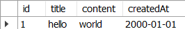
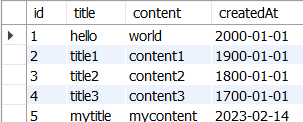

# DML(Data Manipulation Language)
    데이터 조작(추가, 수정, 삭제)
- SQL 키워드
    - INSERT
    - UPDATE
    - DELETE

## 1. INSERT
    INSERT statement : 테이블 레코드 삽입

## INSERT syntax
```sql
INSERT INTO
    table_name (c1, c2, ...)
VALUES
    (v1, v2, ...);
```
- INSERT INTO 절 다음에 테이블 이름과 괄호 안에 필드 목록을 작성
- VALUES 키워드 다음 괄호 안에 해당 필드에 삽입할 값 목록을 작성

### INSERT 예시

```sql
-- 예제 테이블 생성

CREATE TABLE articles(
	id INT AUTO_INCREMENT,
    title VARCHAR(100) NOT NULL,
    content VARCHAR(200) NOT NULL,
    createdAt DATE NOT NULL,
    PRIMARY KEY (id)
);
```

1. articles 테이블에 각 필드에 적합한 데이터 입력
    - 단, createdAt 필드 값은 2000년 1월 1일이며 title과 content 필드 값은 자율
```sql
-- 데이터 한 개 입력

INSERT INTO 
	articles (title, content, createdAt)
VALUES 
	('hello', 'world', '2000-01-01');
```


2. articles 테이블에 각 필드에 적합한 데이터를 3개 입력
    - 단, 모든 필드 값은 자율
```sql
-- 데이터 여러 개 입력

INSERT INTO 
	articles (title, content, createdAt)
VALUES 
	('title1', 'content1', '1900-01-01'),
    ('title2', 'content2', '1800-01-01'),
    ('title3', 'content3', '1700-01-01');
```


3. articles 테이블에 각 필드에 적합한 데이터 입력
    - 단, createdAt 필드에는 현재 작성하는 날짜가 자동으로 입력. 모든 필드 값은 자율
```sql
-- 현재 날짜 데이터 입력

INSERT INTO 
	articles (title, content, createdAt)
VALUES 
	('mytitle', 'mycontent', CURDATE());
```



## 2. UPDATE
    테이블 레코드 수정

## UPDATE syntax
```sql
UPDATE
    table_name
SET
    column_name = expression,
[WHERE
    condition];
```
- SET 절 다음에 수정할 피드와 새 값을 지정
- WHERE 절에서 수정할 레코드를 지정하는 조건 작성
    - WHERE 절을 작성하지 않으면 모든 레코드를 수정

### UPDATE 예시

1. articles 테이블 1번 레코드의 title 필드 값을 'newTitle'로 변경
```sql
-- 필드값을 한 개 수정

UPDATE
	articles
SET
	title = 'newTitle'
WHERE
	id = 1;
```


2. articles 테이블 2번 레코드의 title, content 필드 값을 자유롭게 변경
```sql
-- 필드값을 여러 개 수정

UPDATE
	articles
SET
	title = 'hi!',
    content = 'hello!'
WHERE
	id = 2;
```


3. articles 테이블 모든 레코드의 content 필드 값 중 문자열 'content'를 'TEST'로 변경
```sql
-- 중복된 필드값을 수정

UPDATE
	articles
SET
	content = REPLACE(content, 'content', 'TEST');;
```


## 3. DELETE
    DELETE statement : 테이블 레코드 삭제

## DELETE syntax
```sql
DELETE FROM 
    table_name
[WHERE
    condition];
```
- DELETE FROM 절 다음에 테이블 이름 작성
- WHERE 절에서 삭제할 레코드를 지정하는 조건 작성
    - WHERE 절을 작성하지 않으면 모든 레코드를 삭제

### DELETE 예시

1. articles 테이블의 1번 레코드 삭제
```sql
-- 레코드 한 개 삭제

DELETE FROM 
	articles 
WHERE 
	id = 1;
```


2. articles 테이블에서 가장 최근에 작성된 레코드 2개 삭제
```sql
-- 레코드 여러 개 삭제

DELETE FROM
	articles
ORDER BY
	createdAt DESC -- 날짜를 내림차순 정렬 후
LIMIT 2; -- 레코드 2개 조회
```
