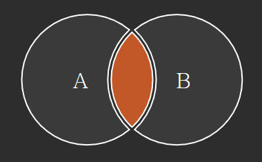
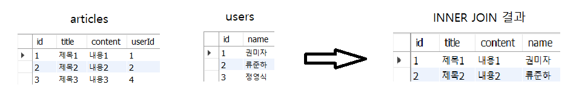
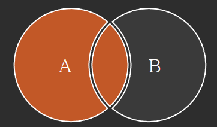
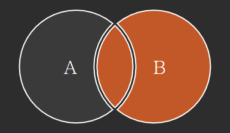
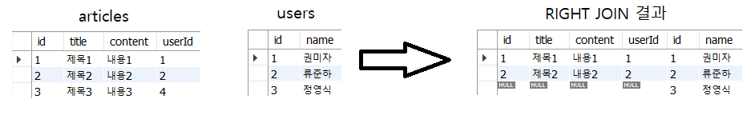
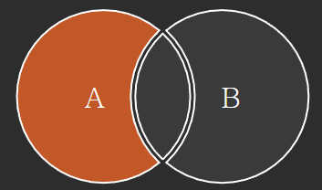
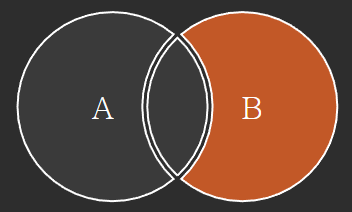
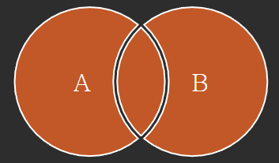

# 관계형 데이터베이스
    여러 테이블 간의 (논리적)연결
    - 일반적으로 데이터베이스에서는 하나의 테이블이 아닌 여러 테이블로 나누어 저장하고 결합하여 출력

# JOIN
    둘 이상의 테이블에서 데이터를 검색하는 방법

## JOIN 종류
- INNER JOIN
- OUTER JOIN
    - LEFT JOIN
    - RIGHT JOIN

## 1. INNER JOIN
    두 테이블에서 값이 일치하는 레코드에 대해서만 결과를 반환


## INNER JOIN syntax
```sql
SELECT
    select_list
FROM
    table1
INNER JOIN table2
    ON table1.fk = table2.pk;
```
- FROM 절 이후 메인 테이블 지정(table1)
- INNER JOIN 절 이후 메인 테이블과 조인할 테이블을 지정(table2)
- ON 키워드 이후 조인 조건을 작성
    - 조인 조건은 table1과 table2 간의 레코드를 일치시키는 규칙을 지정

### INNER JOIN 예시
```sql
SELECT
	*
FROM
	articles
INNER JOIN users
    ON articles.userId = users.id;
```


## 2. LEFT JOIN
    오른쪽 테이블의 일치하는 레코드와 함께 왼쪽 테이블의 모든 레코드 반환


## LEFT JOIN syntax
```sql
SELECT
    select_list
FROM
    table1
LEFT JOIN table2
    ON table1.fk = table2.pk;
```
- FROM 절 이후 왼쪽 테이블 지정(table1)
- LEFT JOIN 절 이후 오른쪽 테이블 지정(table2)
- ON 키워드 이후 조인 조건을 작성
    - 왼쪽 테이블의 각 레코드를 오른쪽 테이블의 모든 레코드와 일치시킴

### LEFT JOIN 예시
```sql
SELECT
	*
FROM
	articles
LEFT JOIN users
    ON articles.userId = users.id;
```


### LEFT JOIN 특징
- 왼쪽은 무조건 표시하고, 매치되는 레코드가 없으면 NULL을 표시
- 왼쪽 테이블 한 개의 레코드에 여러 개의 오른쪽 테이블 레코드가 일치할 경우, 해당 왼쪽 레코드를 여러 번 표시

## 3. RIGHT JOIN
    왼쪽 테이블의 일치하는 레코드와 함께 오른쪽 테이블의 모든 레코드 반환


## RIGHT JOIN syntax
```sql
SELECT
    select_list
FROM
    table1
RIGHT JOIN table2
    ON table1.fk = table2.pk;
```
- FROM 절 이후 왼쪽 테이블 지정(table1)
- RIGHT JOIN 절 이후 오른쪽 테이블 지정(table2)
- ON 키워드 이후 조인 조건을 작성
    - 오른쪽 테이블의 각 레코드를 왼쪽 테이블의 모든 레코드와 일치시킴

### RIGHT JOIN 예시
```sql
SELECT
	*
FROM
	articles
RIGHT JOIN users
    ON articles.userId = users.id;
```


### RIGHT JOIN 특징
- 오른쪽은 무조건 표시하고, 매치되는 레코드가 없으면 NULL을 표시
- 오른쪽 테이블 한 개의 레코드에 왼쪽 테이블 레코드가 일치할 경우, 해당 오른쪽 레코드를 여러 번 표시

## JOIN 정리
1. INNER JOIN
    ```sql
    SELECT
        *
    FROM
        table1
    INNER JOIN table2
        ON table1.fk = table2.id;
    ```
    

2. LEFT JOIN
    - 2 - 1
    ```sql
    SELECT
        *
    FROM
        table1
    LEFT JOIN table2
        ON table1.fk = table2.id;
    ```
    
    - 2 - 2
    ```sql
    SELECT
        *
    FROM
        table1
    LEFT JOIN table2
        ON table1.fk = table2.id
    WHERE table2.id IS NULL;
    ```
    

3. RIGHT JOIN
    - 3 - 1
    ```sql
    SELECT
        *
    FROM
        table1
    RIGHT JOIN table2
        ON table1.fk = table2.id;
    ```
    
    - 3 - 2
    ```sql
    SELECT
        *
    FROM
        table1
    RIGHT JOIN table2
        ON table1.fk = table2.id
    WHERE table1.fk IS NULL;
    ```
    

4. FULL OUTER JOIN
    ```sql
    SELECT * FROM table1
    LEFT JOIN table2 ON table1.fk = table2.id
    UNION  -- mysql에선 FULL OUTER JOIN 적용 X
    SELECT * FROM table1
    RIGHT JOIN table2 ON table1.fk = table2.id;
    ```
    