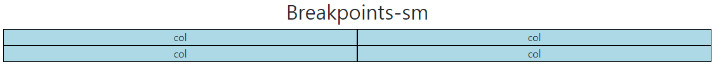

# Responsive Web Design
    - 디바이스 종류나 화면 크기에 상관없이, 어디에서든 일관된 레이아웃 및 사용자 경험을 제공하는 디자인 기술
    - Bootstrap grid system의 12개 column과 6개 breakpoints를 사용하여 반응형 웹 디자인을 구현

# Grid system breakpoints
    - 웹 페이지를 다양한 화면 크기에서 적절하게 배치하기 위한 분기점
    - 화면 너비에 따라 6개의 분기점 제공(xs, sm, md, lg, xl, xxl)
    - Grid system은 화면 크기(breakpoints)에 따라 12개의 칸을 각 요소에 나누어 주는 것


- 각 breakpoints 마다 설정된 최대 너비 값 "이상으로" 화면이 커지면 grid system 동작이 변경됨

## Breakpoints 예시
### xs
```html
<h2 style="text-align: center;">Breakpoints-xs</h2>
<div class="container">
    <div class="row">
        <div class="col-12">
            <div class="box">col</div>
        </div>
        <div class="col-12">
            <div class="box">col</div>
        </div>
        <div class="col-12">
            <div class="box">col</div>
        </div>
        <div class="col-12">
            <div class="box">col</div>
        </div>
    </div>
</div>
```


### sm
```html
<h2 style="text-align: center;">Breakpoints-sm</h2>
<div class="container">
    <div class="row g-0">
        <div class="col-12 col-sm-6">
            <div class="box">col</div>
        </div>
        <div class="col-12 col-sm-6">
            <div class="box">col</div>
        </div>
        <div class="col-12 col-sm-6">
            <div class="box">col</div>
        </div>
        <div class="col-12 col-sm-6">
            <div class="box">col</div>
        </div>
    </div>
</div>
```



### md
```html
<h2 style="text-align: center;">Breakpoints-md</h2>
<div class="container">
    <div class="row g-0">
        <div class="col-12 col-sm-6 col-md-2">
            <div class="box">col</div>
        </div>
        <div class="col-12 col-sm-6 col-md-8">
            <div class="box">col</div>
        </div>
        <div class="col-12 col-sm-6 col-md-2">
            <div class="box">col</div>
        </div>
        <div class="col-12 col-sm-6 col-md-12">
            <div class="box">col</div>
        </div>
    </div>
</div>
```


### lg
```html
<h2 style="text-align: center;">Breakpoints-lg</h2>
<div class="container">
    <div class="row g-0">
        <div class="col-12 col-sm-6 col-md-2 col-lg-3">
            <div class="box">col</div>
        </div>
        <div class="col-12 col-sm-6 col-md-8 col-lg-3">
            <div class="box">col</div>
        </div>
        <div class="col-12 col-sm-6 col-md-2 col-lg-3">
            <div class="box">col</div>
        </div>
        <div class="col-12 col-sm-6 col-md-12 col-lg-3">
            <div class="box">col</div>
        </div>
    </div>
</div>
```


### xl
```html
<h2 style="text-align: center;">Breakpoints-xl</h2>
<div class="container">
    <div class="row g-0">
        <div class="col-12 col-sm-6 col-md-2 col-lg-3 col-xl-4">
            <div class="box">col</div>
        </div>
        <div class="col-12 col-sm-6 col-md-8 col-lg-3 col-xl-4">
            <div class="box">col</div>
        </div>
        <div class="col-12 col-sm-6 col-md-2 col-lg-3 col-xl-4">
            <div class="box">col</div>
        </div>
        <div class="col-12 col-sm-6 col-md-12 col-lg-3 col-xl-12">
            <div class="box">col</div>
        </div>
    </div>
</div>
```


### breakpoints + offset
```html
<h2 style="text-align: center;">breakpoints + offset</h2>
<div class="container">
    <div class="row g-0">
        <div class="col-12 col-sm-4 col-md-6">
            <div class="box">col</div>
        </div>
        <div class="col-12 col-sm-4 col-md-6">
            <div class="box">col</div>
        </div>
        <div class="col-12 col-sm-4 col-md-6">
            <div class="box">col</div>
        </div>
        <div class="col-12 col-sm-4 offset-sm-4 col-md-6 offset-md-0">
            <div class="box">col</div>
        </div>
    </div>
</div>
```


---

## 참고

## Grid cards
- row-cols 클래스를 사용하여 생당 표시할 열(카드) 수를 손쉽게 제어할 수 있음

```html
<div class="container">
    <div class="row row-cols-1 row-cols-md-2 g-4">
        <div class="col">
            <div class="card">
                
                <div class="card-body">
                    <h5 class="card-title">Card title</h5>
                    <p class="card-text">This is a longer card with supporting text below as a natural lead-in to additional content. This content is a little bit longer.</p>
                </div>
            </div>
        </div>
        <div class="col">
            <div class="card">
                
                <div class="card-body">
                    <h5 class="card-title">Card title</h5>
                    <p class="card-text">This is a longer card with supporting text below as a natural lead-in to additional content. This content is a little bit longer.</p>
                </div>
            </div>
        </div>
        <div class="col">
            <div class="card">
                
                <div class="card-body">
                    <h5 class="card-title">Card title</h5>
                    <p class="card-text">This is a longer card with supporting text below as a natural lead-in to additional content.</p>
                </div>
            </div>
        </div>
        <div class="col">
            <div class="card">
                
                <div class="card-body">
                    <h5 class="card-title">Card title</h5>
                    <p class="card-text">This is a longer card with supporting text below as a natural lead-in to additional content. This content is a little bit longer.</p>
                </div>
            </div>
        </div>
    </div>
</div>
```

