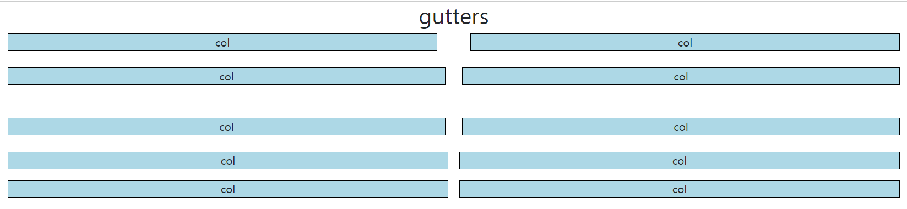

# Bootstrap Grid system
    - 웹 페이지의 레이아웃을 조정하는 데 사용되는 12개의 컬럼으로 구성된 시스템
    - 반응형 디자인을 지원해 웹 페이지를 모바일, 태블릿, 데스크탑 등 다양한 기기에서 적절하게 표시할 수 있도록 도움

## 12
    - 적당히 크고 많은 약수를 가진 수
    - 1개의 row에 12개의 column 존재

### 12개의 컬럼 사용 예시
- google news

.png)
.png)

## Grid system 핵심 클래스
```html
<div class="container">
    <div class="row">
        <div class="col-4"></div>
        <div class="col-4"></div>
        <div class="col-4"></div>
    </div>
</div>
```
- 1개의 row안에 12칸의 column 영역이 구성
- 각 요소는 12칸 중 몇 개를 차지할 것인지 지정됨

### grid system 기본
```html
<h2 style="text-align: center;">Basic</h2>
<div class="container">
    <div class="row">
        <div class="box col-4">col</div>
        <div class="box col-4">col</div>
        <div class="box col-4">col</div>
    </div>
    <div class="row">
        <div class="box col-2">col</div>
        <div class="box col-8">col</div>
        <div class="box col-2">col</div>
    </div>
    <div class="row">
        <div class="box col-4">col</div>
        <div class="box col-2">col</div>
    </div>
</div>
```


### grid system 중첩
```html
<h2 style="text-align: center;">Nesting</h2>
<div class="container">
    <div class="row">
        <div class="box col-4">col</div>
        <div class="box col-8">
            <div class="row">
                <div class="box col-6">col</div>
                <div class="box col-6">col</div>
                <div class="box col-6">col</div>
                <div class="box col-6">col</div>
            </div>
        </div>
    </div>
</div>
```


### grid system offset
```html
<h2 style="text-align: center;">Offset</h2>
<div class="container">
    <div class="row">
        <div class="box col-4">col</div>
        <div class="box col-4 offset-4">col</div>
    </div>
    <div class="row">
        <div class="box col-3 offset-3">col</div>
        <div class="box col-3 offset-3">col</div>
    </div>
    <div class="row">
        <div class="box col-6 offset-3">col</div>
    </div>
</div>
```


# Gutters
    Grid system에서 column 사이에 padding 영역

### Gutters 구조
- gx-* : 수평
- gy-* : 수직
- g-* : 수평수직

```html
<h2 style="text-align: center;">gutters</h2>
<div class="container">
    <div class="row gx-5">
        <div class="col-6">
            <div class="box">col</div>
        </div>
        <div class="col-6">
            <div class="box">col</div>
        </div>
    </div>
</div>
<br>
<div class="container">
    <div class="row gy-5">
        <div class="col-6">
            <div class="box">col</div>
        </div>
        <div class="col-6">
            <div class="box">col</div>
        </div>
        <div class="col-6">
            <div class="box">col</div>
        </div>
        <div class="col-6">
            <div class="box">col</div>
        </div>
    </div>
</div>
<br>
<div class="container">
    <div class="row g-3">
        <div class="col-6">
            <div class="box">col</div>
        </div>
        <div class="col-6">
            <div class="box">col</div>
        </div>
        <div class="col-6">
            <div class="box">col</div>
        </div>
        <div class="col-6">
            <div class="box">col</div>
        </div>
    </div>
</div>
```
