# 그래프 탐색 알고리즘
    - 시작 정점에서 간선을 타고 이동할 수 있는 모든 정점을 찾는 알고리즘
    - 깊이우선탐색(DFS)과 너비우선탐색(BFS)이 있다.

# 깊이우선탐색(Depth-First Search, DFS)
    - 시작 정점으로부터 갈 수 있는 하위 정점까지 가장 깊게 탐색하고, 더 이상 갈 곳이 없다면 마지막 갈림길로 돌아와서 다른 정점을 탐색하며 결국 모든 정점을 방문하는 순회 방법
    - 그래프의 깊이를 우선으로 탐색하기 위해 스택의 개념을 활용한다.

## DFS의 특징
- **모든 정점을 방문**할 때 유리하다. **경우의 수, 순열과 조합** 문제에서 많이 사용한다.
- 너비우선탐색(BFS)에 비해 코드 구현이 간단하다.
- 모든 정점을 방문할 필요가 없거나 최단 거리를 구하는 경우에는 BFS가 유리하다.

## DFS의 동작 과정
1. 먼저 탐색을 진행할 그래프가 필요하다.(그래프는**인접 행렬** 또는 **인접 리스트** 방식으로 표현)
```python
# 인접 행렬
graph = [
    [0, 1, 1, 0, 0, 0, 0],
    [1, 0, 0, 1, 1, 0, 0],
    [1, 0, 0, 0, 1, 1, 0],
    [0, 1, 0, 0, 0, 0, 0],
    [0, 1, 1, 0, 0, 0, 1],
    [0, 0, 1, 0, 0, 0, 0],
    [0, 0, 0, 0, 1, 0, 0]
]

# 인접 리스트
graph = [
    [1, 2],
    [0, 3, 4],
    [0, 4, 5],
    [1],
    [1, 2, 6],
    [2],
    [4]
]
```

2. **각 정점을 방문했는지 여부를 판별**할 방문 체크 리스트가 필요하다.
```python
visited = [False] * n # n은 정점의 개수
```
| 정점 i | 0 | 1 | 2 | 3 | 4 | 5 | 6 |
|:---:|:---:|:---:|:---:|:---:|:---:|:---:|:---:|
| visited[i] | False | False | False | False | False | False | False |

- 인덱스는 각 정점의 번호
- 방문한 정점은 True, 방문하지 않은 정점은 False

2-1) 
| 정점 i | 0 | 1 | 2 | 3 | 4 | 5 | 6 |
|:---:|:---:|:---:|:---:|:---:|:---:|:---:|:---:|
| visited[i] | False | False | False | False | False | False | False |

```python
# 현재


# 스택
stack = [
    [],
    [],
    []
]
```
- DFS의 사이클
1. 정점 방문 처리 및 스택에 값 삽입
2. 스택 마지막 값 꺼내고 인접한 정점 확인
3. 방문하지 않은 인접 정점 -> 1번

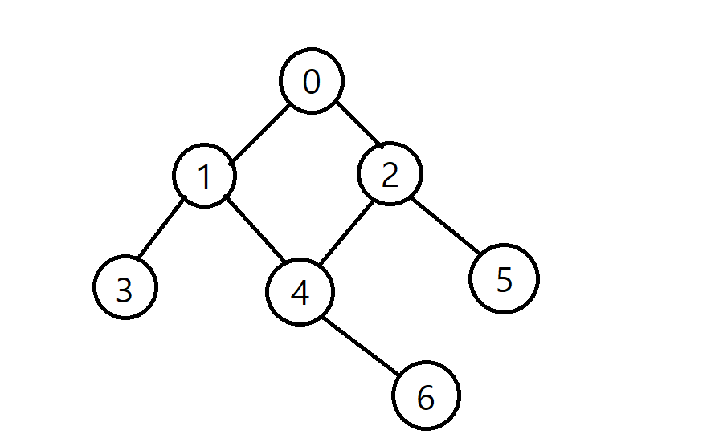


2-2) 
| 정점 i | 0 | 1 | 2 | 3 | 4 | 5 | 6 |
|:---:|:---:|:---:|:---:|:---:|:---:|:---:|:---:|
| visited[i] | True | False | False | False | False | False | False |

```python
# 현재


# 스택
stack = [
    [],
    [],
    [0]
]
```
- DFS의 사이클
1. **정점 방문 처리 및 스택에 값 삽입**
2. 스택 마지막 값 꺼내고 인접한 정점 확인
3. 방문하지 않은 인접 정점 -> 1번

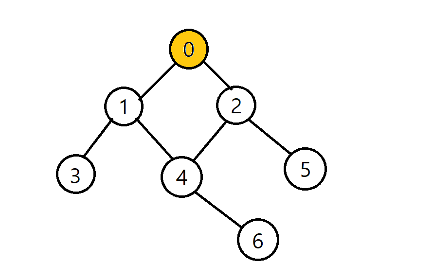


2-3) 
| 정점 i | 0 | 1 | 2 | 3 | 4 | 5 | 6 |
|:---:|:---:|:---:|:---:|:---:|:---:|:---:|:---:|
| visited[i] | True | False | False | False | False | False | False |

```python
# 현재
0

# 스택
stack = [
    [],
    [],
    []
]
```
- DFS의 사이클
1. 정점 방문 처리 및 스택에 값 삽입
2. **스택 마지막 값 꺼내고 인접한 정점 확인**
3. 방문하지 않은 인접 정점 -> 1번

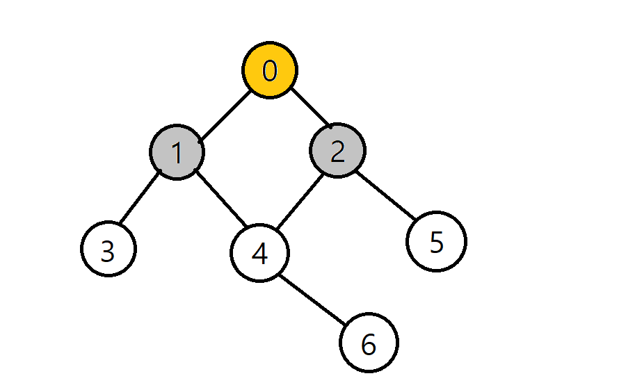


2-4) 
| 정점 i | 0 | 1 | 2 | 3 | 4 | 5 | 6 |
|:---:|:---:|:---:|:---:|:---:|:---:|:---:|:---:|
| visited[i] | True | True | False | False | False | False | False |

```python
# 현재
0

# 스택
stack = [
    [],
    [],
    [1]
]
```
- DFS의 사이클
1. 정점 방문 처리 및 스택에 값 삽입
2. 스택 마지막 값 꺼내고 인접한 정점 확인
3. **방문하지 않은 인접 정점 -> 1번**


2-5) 
| 정점 i | 0 | 1 | 2 | 3 | 4 | 5 | 6 |
|:---:|:---:|:---:|:---:|:---:|:---:|:---:|:---:|
| visited[i] | True | True | True | False | False | False | False |

```python
# 현재
0

# 스택
stack = [
    [],
    [2],
    [1]
]
```
- DFS의 사이클
1. 정점 방문 처리 및 스택에 값 삽입
2. 스택 마지막 값 꺼내고 인접한 정점 확인
3. **방문하지 않은 인접 정점 -> 1번**


2-6) 
| 정점 i | 0 | 1 | 2 | 3 | 4 | 5 | 6 |
|:---:|:---:|:---:|:---:|:---:|:---:|:---:|:---:|
| visited[i] | True | True | True | False | False | False | False |

```python
# 현재
2

# 스택
stack = [
    [],
    [],
    [1]
]
```
- DFS의 사이클
1. 정점 방문 처리 및 스택에 값 삽입
2. **스택 마지막 값 꺼내고 인접한 정점 확인**
3. 방문하지 않은 인접 정점 -> 1번

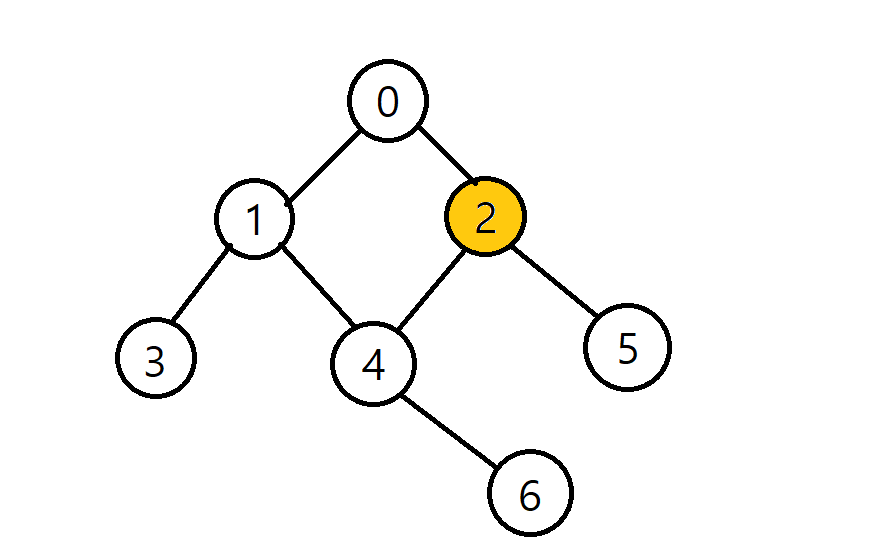


2-7) 
| 정점 i | 0 | 1 | 2 | 3 | 4 | 5 | 6 |
|:---:|:---:|:---:|:---:|:---:|:---:|:---:|:---:|
| visited[i] | True | True | True | False | False | False | False |

```python
# 현재
2

# 스택
stack = [
    [],
    [],
    [1]
]
```
- DFS의 사이클
1. 정점 방문 처리 및 스택에 값 삽입
2. **스택 마지막 값 꺼내고 인접한 정점 확인**
3. 방문하지 않은 인접 정점 -> 1번

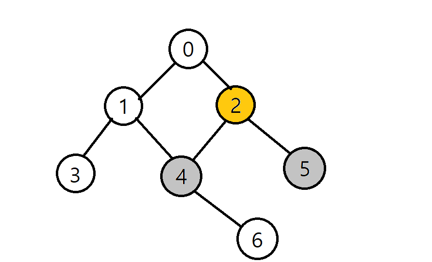


2-8) 
| 정점 i | 0 | 1 | 2 | 3 | 4 | 5 | 6 |
|:---:|:---:|:---:|:---:|:---:|:---:|:---:|:---:|
| visited[i] | True | True | True | False | True | False | False |

```python
# 현재
2

# 스택
stack = [
    [],
    [4],
    [1]
]
```
- DFS의 사이클
1. 정점 방문 처리 및 스택에 값 삽입
2. 스택 마지막 값 꺼내고 인접한 정점 확인
3. **방문하지 않은 인접 정점 -> 1번**


2-9) 
| 정점 i | 0 | 1 | 2 | 3 | 4 | 5 | 6 |
|:---:|:---:|:---:|:---:|:---:|:---:|:---:|:---:|
| visited[i] | True | True | True | False | True | True | False |

```python
# 현재
2

# 스택
stack = [
    [5],
    [4],
    [1]
]
```
- DFS의 사이클
1. 정점 방문 처리 및 스택에 값 삽입
2. 스택 마지막 값 꺼내고 인접한 정점 확인
3. **방문하지 않은 인접 정점 -> 1번**


2-10) 
| 정점 i | 0 | 1 | 2 | 3 | 4 | 5 | 6 |
|:---:|:---:|:---:|:---:|:---:|:---:|:---:|:---:|
| visited[i] | True | True | True | False | True | True | False |

```python
# 현재
5

# 스택
stack = [
    [],
    [4],
    [1]
]
```
- DFS의 사이클
1. 정점 방문 처리 및 스택에 값 삽입
2. **스택 마지막 값 꺼내고 인접한 정점 확인**
3. 방문하지 않은 인접 정점 -> 1번

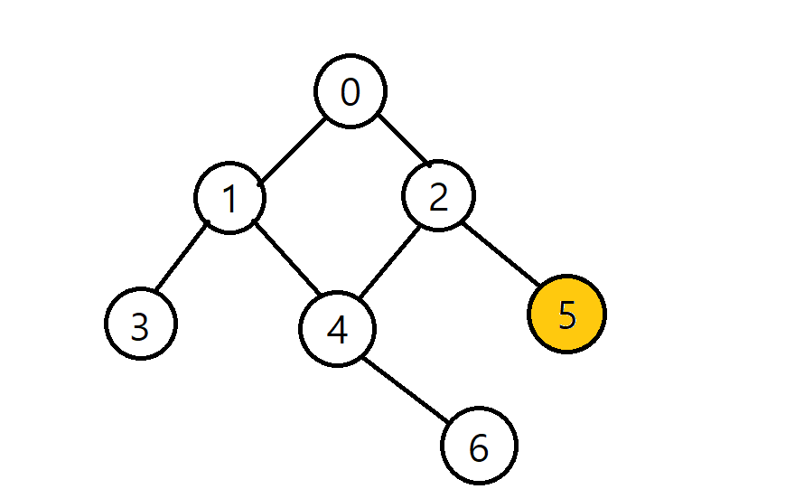


2-11) 
| 정점 i | 0 | 1 | 2 | 3 | 4 | 5 | 6 |
|:---:|:---:|:---:|:---:|:---:|:---:|:---:|:---:|
| visited[i] | True | True | True | False | True | True | False |

```python
# 현재
4

# 스택
stack = [
    [],
    [],
    [1]
]
```
- DFS의 사이클
1. 정점 방문 처리 및 스택에 값 삽입
2. **스택 마지막 값 꺼내고 인접한 정점 확인**
3. 방문하지 않은 인접 정점 -> 1번

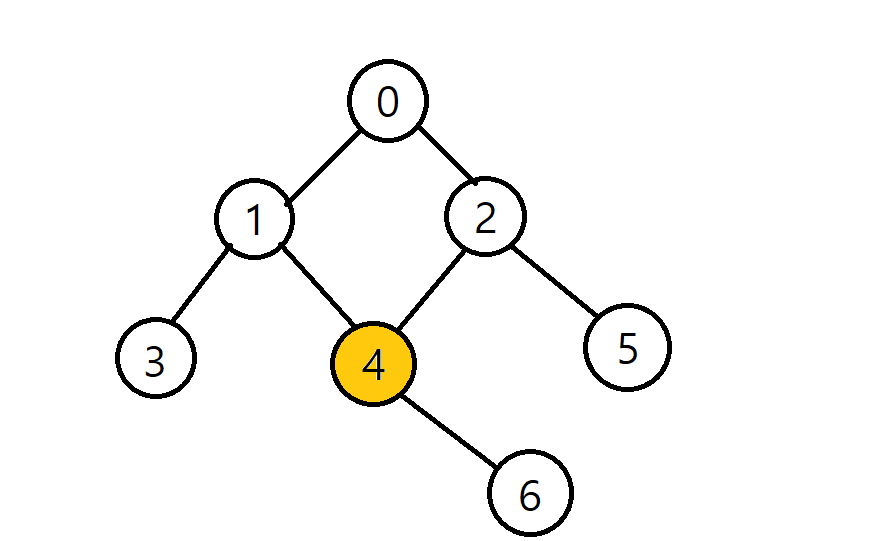


2-12) 
| 정점 i | 0 | 1 | 2 | 3 | 4 | 5 | 6 |
|:---:|:---:|:---:|:---:|:---:|:---:|:---:|:---:|
| visited[i] | True | True | True | False | True | True | False |

```python
# 현재
4

# 스택
stack = [
    [],
    [],
    [1]
]
```
- DFS의 사이클
1. 정점 방문 처리 및 스택에 값 삽입
2. **스택 마지막 값 꺼내고 인접한 정점 확인**
3. 방문하지 않은 인접 정점 -> 1번

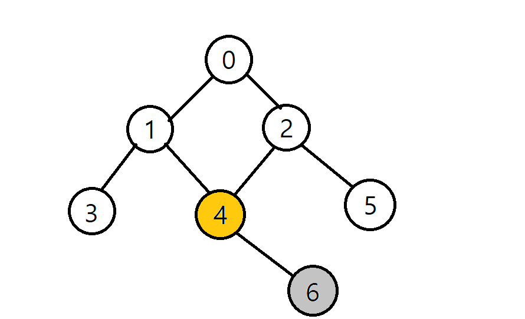


2-13) 
| 정점 i | 0 | 1 | 2 | 3 | 4 | 5 | 6 |
|:---:|:---:|:---:|:---:|:---:|:---:|:---:|:---:|
| visited[i] | True | True | True | False | True | True | True |

```python
# 현재
4

# 스택
stack = [
    [],
    [6],
    [1]
]
```
- DFS의 사이클
1. 정점 방문 처리 및 스택에 값 삽입
2. 스택 마지막 값 꺼내고 인접한 정점 확인
3. **방문하지 않은 인접 정점 -> 1번**


2-14) 
| 정점 i | 0 | 1 | 2 | 3 | 4 | 5 | 6 |
|:---:|:---:|:---:|:---:|:---:|:---:|:---:|:---:|
| visited[i] | True | True | True | False | True | True | True |

```python
# 현재
6

# 스택
stack = [
    [],
    [],
    [1]
]
```
- DFS의 사이클
1. 정점 방문 처리 및 스택에 값 삽입
2. **스택 마지막 값 꺼내고 인접한 정점 확인**
3. 방문하지 않은 인접 정점 -> 1번

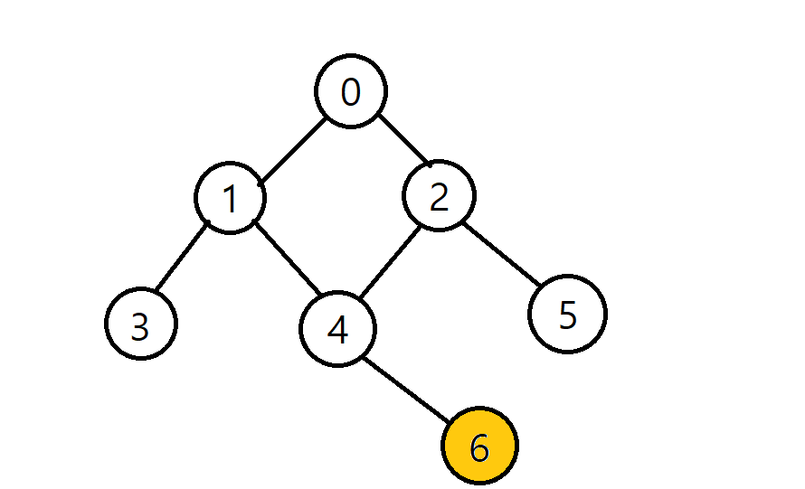


2-14) 
| 정점 i | 0 | 1 | 2 | 3 | 4 | 5 | 6 |
|:---:|:---:|:---:|:---:|:---:|:---:|:---:|:---:|
| visited[i] | True | True | True | False | True | True | True |

```python
# 현재
1

# 스택
stack = [
    [],
    [],
    []
]
```
- DFS의 사이클
1. 정점 방문 처리 및 스택에 값 삽입
2. **스택 마지막 값 꺼내고 인접한 정점 확인**
3. 방문하지 않은 인접 정점 -> 1번

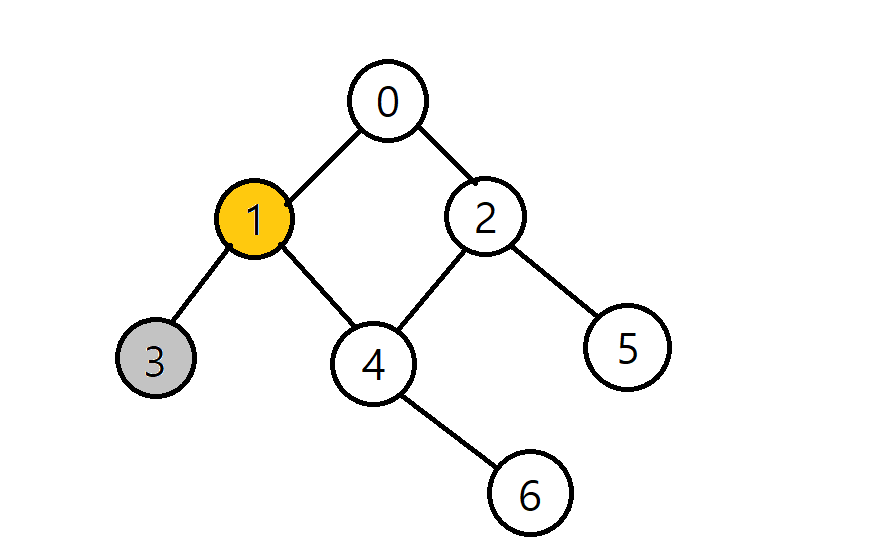


2-15) 
| 정점 i | 0 | 1 | 2 | 3 | 4 | 5 | 6 |
|:---:|:---:|:---:|:---:|:---:|:---:|:---:|:---:|
| visited[i] | True | True | True | True | True | True | True |

```python
# 현재
1

# 스택
stack = [
    [],
    [],
    [3]
]
```
- DFS의 사이클
1. 정점 방문 처리 및 스택에 값 삽입
2. 스택 마지막 값 꺼내고 인접한 정점 확인
3. **방문하지 않은 인접 정점 -> 1번**


2-16) 
| 정점 i | 0 | 1 | 2 | 3 | 4 | 5 | 6 |
|:---:|:---:|:---:|:---:|:---:|:---:|:---:|:---:|
| visited[i] | True | True | True | True | True | True | True |

```python
# 현재
3

# 스택
stack = [
    [],
    [],
    []
]
```
- DFS의 사이클
1. 정점 방문 처리 및 스택에 값 삽입
2. **스택 마지막 값 꺼내고 인접한 정점 확인**
3. 방문하지 않은 인접 정점 -> 1번

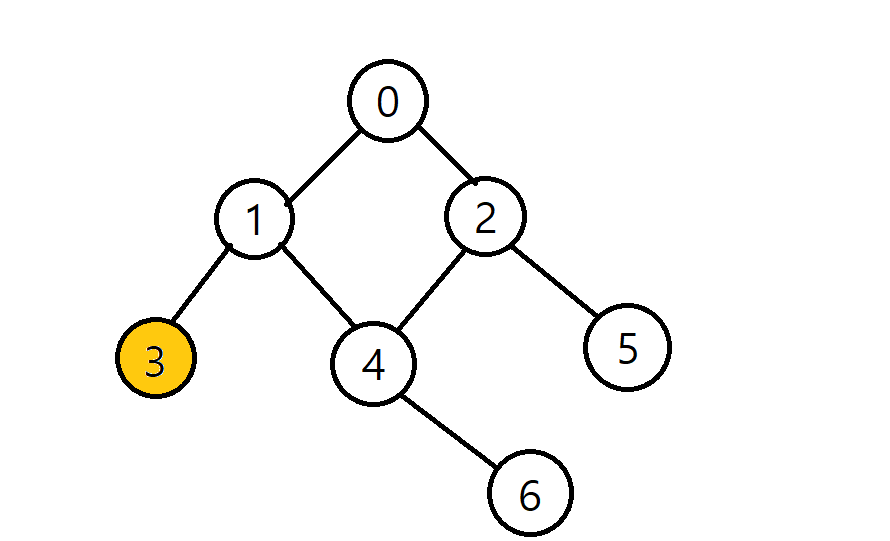


2-17) 
| 정점 i | 0 | 1 | 2 | 3 | 4 | 5 | 6 |
|:---:|:---:|:---:|:---:|:---:|:---:|:---:|:---:|
| visited[i] | True | True | True | True | True | True | True |

```python
# 현재


# 스택
stack = [
    [],
    [],
    []
]
```
- DFS의 사이클
1. 정점 방문 처리 및 스택에 값 삽입
2. 스택 마지막 값 꺼내고 인접한 정점 확인
3. 방문하지 않은 인접 정점 -> 1번


2-17) 
| 정점 i | 0 | 1 | 2 | 3 | 4 | 5 | 6 |
|:---:|:---:|:---:|:---:|:---:|:---:|:---:|:---:|
| visited[i] | True | True | True | True | True | True | True |

- 방문 정점 순서
    - 0 - 2 - 5 - 4 - 6 - 1 - 3

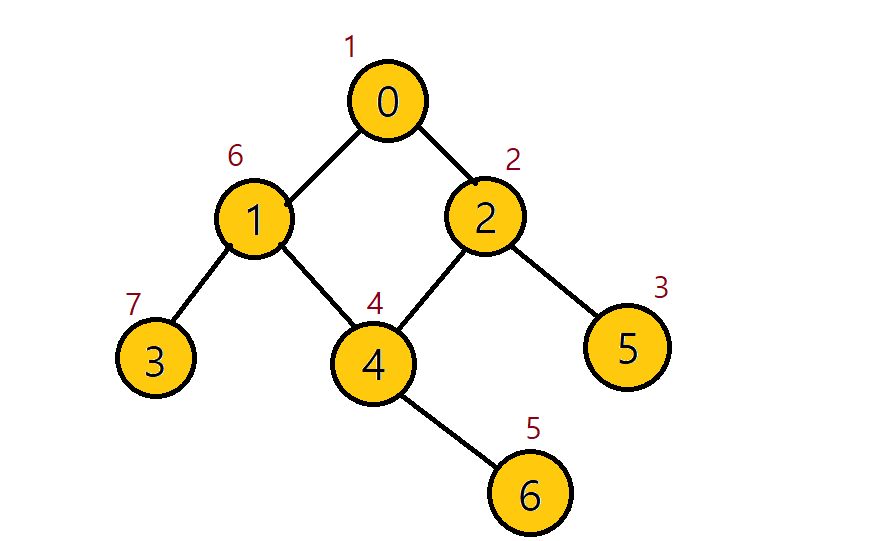


## DFS 구현 방식
- 인접 리스트로 그래프를 표현


```python
graph = [
    [1, 2],
    [0, 3, 4],
    [0, 4, 5],
    [1],
    [1, 2, 6],
    [2],
    [4]
]
```

### 반복문을 이용한 DFS
- DFS는 직전에 방분한 정점으로 차례로 돌아가야 하므로, 후입선출(LIFO)구조의 **스택**을 사용한다.

```python
graph = [
    [1, 2],
    [0, 3, 4],
    [0, 4, 5],
    [1],
    [1, 2, 6],
    [2],
    [4]
]

visited = [False] * n # 방문 처리 리스트 만들기

def dfs(start):
    stack = [start] # 돌아갈 곳을 기록
    visited[start] = True # 시작 정점 방문 처리

    while stack: # 스택이 빌 때까지(돌아갈 곳이 없을 때까지) 반복
        cur = stack.pop() # 현재 방문 정점(후입선출)

        for adj in graph[cur]: # 인접한 모든 정점에 대해
            if not visited[adj]: # 아직 방문하지 않았다면
                visited[adj] = True # 방문 처리
                stack.append(adj) # 스택에 넣기
dfs(0) # 0번 정점에서 시작
```