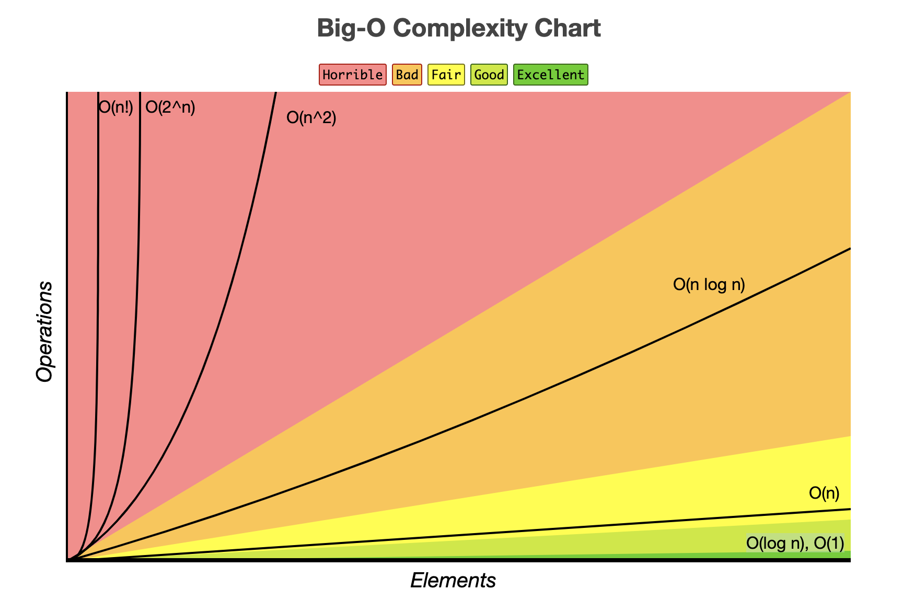

## 시간 복잡도
    계산 복잡도 이론에서 시간 복잡도는 문제를 해결하는데 걸리는 시간과 입력의 함수 관계를 가리킨다.
- 알고리즘의 수행 시간을 의미
    - 시간 복잡도가 높다 -> 느린 알고리즘
    - 시간 복잡도가 낮다 -> 빠른 알고리즘

### 시간 복잡도 계산하기
1. Sequence of statement
```python
statement 1;
statement 1;
statement 1;
...
statement k;
# 총 시간 = 시간(statement 1) + ... + 시간(statement k)
```

2. 조건문
```python
if (조건):
    code block1;
else:
    code block2;
# 총 시간 = max(시간(code block1), 시간(code block2))
```

3. 반복문
- 기본 반복문
```python
for i in range(N):
    code block1;
# 반복이 N번 실행되므로 코드 브록도 N번 실행
```
- 중첩 반복문
```python
for i in range(N):
    for j in range(M):
        code block1;
# 외부 반복은 N번 실행, 내부 반복은 M번 실행되므로 N * M번 실행
```
- 반복문 2개
```python
for i in range(N):
    code block1;

for j in range(M):
    code block2;
# 첫 번째 반복문 N번 실행, 두 번째 반복문 M번 실행되므로 N + M번 실행
```
- 반복문 3개
```python
for i in range(N):
    for j in range(N):
        code block1;
for k in range(N)
# 첫 번째 반복문 N * M, 두 번째 반복문 N번 실행되므로 N**2 + M번 실행
```
- 반복문 범위 지정
```python
for i in range(N):
    for j in range(i, N):
        code block1;
# 외부 반복은 N번 실행, 내부 반복은 M - i번 실행되므로 N * (N-i)번 실행
```

## 빅오(Big-O) 표기법
    입력 n이 무한대로 커진다고 가정하고 시간 복잡도를 간단하게 표시한 것


- O(1) : 단순 산술 계산(사칙 연산)
- O(logN) : 크기 N인 리스트를 반절씩 순회/탐색(이진 탐색, 분할 정복)
- O(N) : 크기 N인 리스트를 순회(1중 for문)
- O(NlogN) : 크기 N인 리스트를 반절씩 탐색 * 순회(높은 성능의 정렬(Merge, Quick, Heap Sort))
- O(N^2) : 크기 M, N인 2중 리스트를 순회(2중 for문)
- O(N^3) : 3중 리스트를 순회(3중 for문)
- O(2^N) : 크기 N 집합의 부분 집합
- O(N!) : 크기 N 리스트의 순열