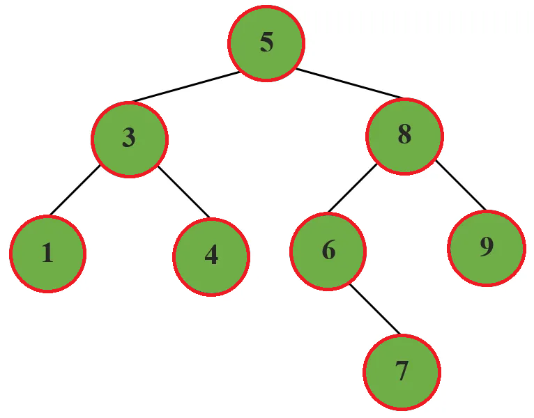
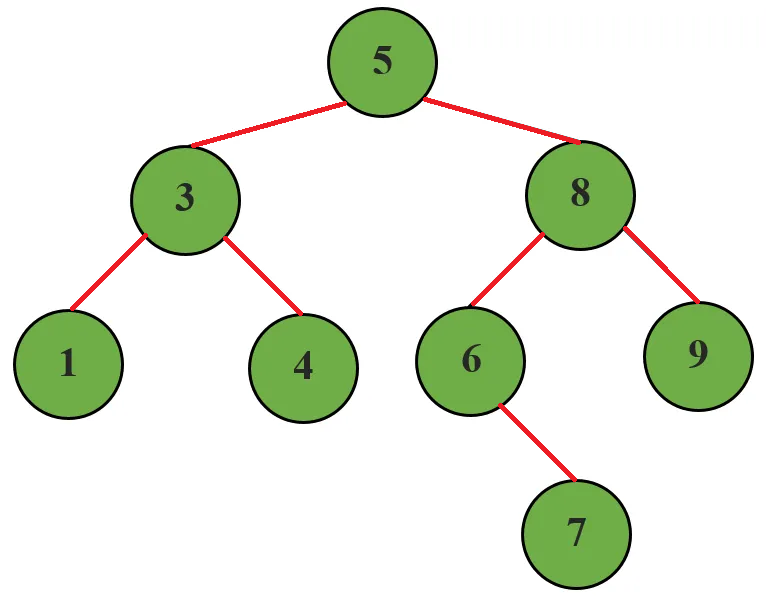
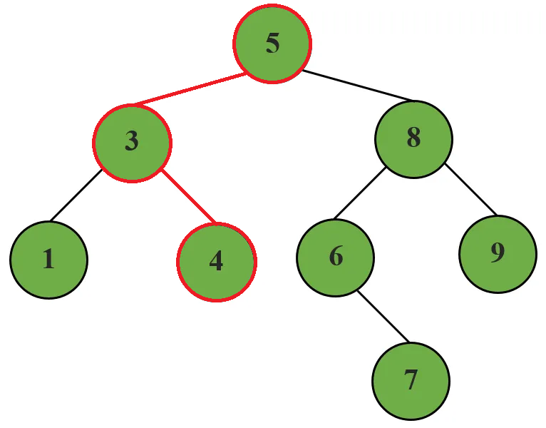
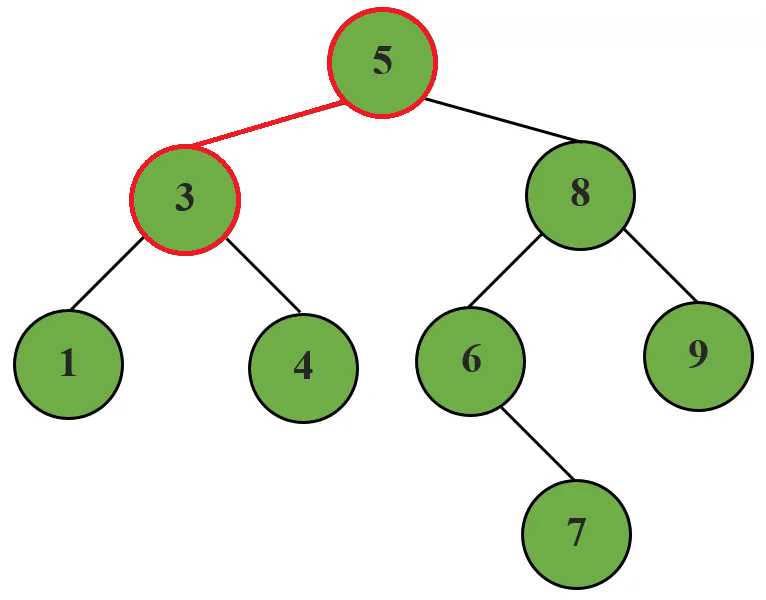
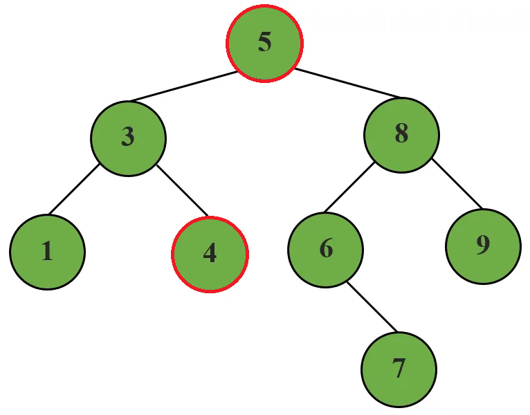
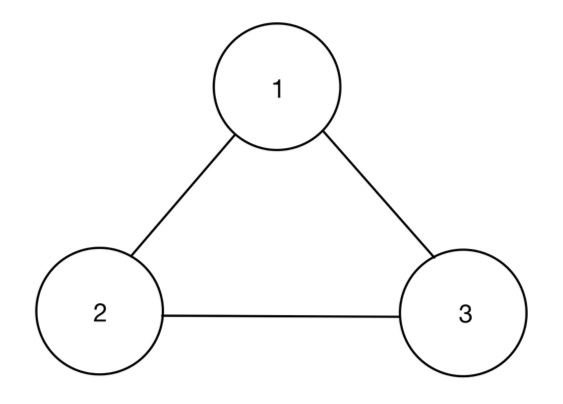
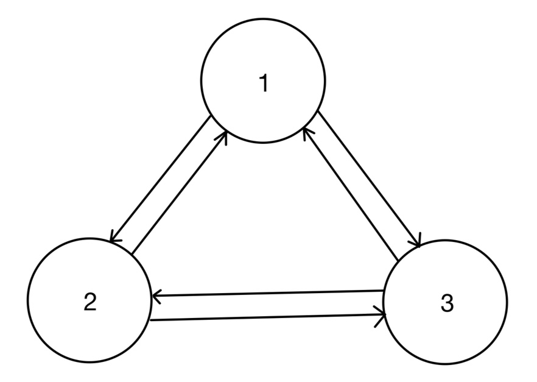
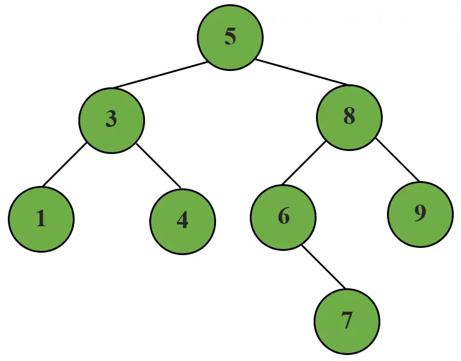

# 그래프(Graph)
    정점(Vertex)과 이를 연결하는 간선(Edge)들의 집합으로 이루어진 비선형 자료구조

## 그래프 용어
- 정점(Vertex) : 간선으로 연결되는 객체이며, 노드(Node)라고도 한다.
- 간선(Edge) : 정점 간의 관계(연결)를 표현하는 선의 의미
- 경로(Path) : 시작 정점부터 도착 정점까지 거치는 정점을 나열한 것을 의미
- 인접(Adjacency) : 두 개의 정점이 하나의 간선으로 직접 연결된 상태를 의미

### 1. 정점(Vertex)


### 2. 간선(Edge)


### 3. 경로(Path)
- 5번 정점부터 4번 정점까지의 경로
    - 5 -> 3 -> 4



### 4. 인접(Adjacency)
- 3, 5는 인접하다.



- 5, 4는 인접하지 않다.



## 그래프의 종류
1. 무방향 그래프(Undirected graph)
- 간선의 방향이 없는 가장 일반적인 그래프
- 간선을 통해 양방향의 정점 이동 가능
- 차수(Degree) : 하나의 정점에 연결된 간선의 개수
    - 모든 정점의 차수의 합 : 간선 수 X 2



2. 유방향 그래프(Directed graph)
- 간선의 방향이 있는 그래프
- 간선의 방향이 가리키는 정점으로 이동 가능
- 차수(Degree) : 진입 차수와 진출 차수로 나누어짐
    - 진입 차수(In-degree) : 외부 정점에서 한 정점으로 들어오는 간선의 수
    - 진출 차수(Out-degree) : 한 정점에서 외부 정점으로 나가는 간선의 수



## 그래프의 표현
1. 인접 행렬(Adjacency matrix)
- 두 정점을 연결하는 간선이 없으면 0, 있으면 1을 가지는 행렬
- 정점의 개수와 관계를 지님.
```python
Adjacency_matrix = [
    [0, 1, 1, 0, 0, 0, 0],
    [1, 0, 0, 1, 1, 0, 0],
    [1, 0, 0, 0, 1, 1, 0],
    [0, 1, 0, 0, 0, 0, 0],
    [0, 1, 1, 0, 0, 0, 1],
    [0, 0, 1, 0, 0, 0, 0],
    [0, 0, 0, 0, 1, 0, 0]
]
```
```python
# 예시

# 입력
0 1
0 2
1 3
1 4
2 4
2 5
4 6

# 인접 행렬 만들기

n = 7 # 정점 개수
m = 7 # 간선 개수

graph = [[0] * n for _ in range(n)]

for _ in range(m):
    v1, v2 = map(int, input().split())
    graph[v1][v2] = 1
    graph[v2][v1] = 1

# 인접 행렬 결과

graph = [
    [0, 1, 1, 0, 0, 0, 0],
    [1, 0, 0, 1, 1, 0, 0],
    [1, 0, 0, 0, 1, 1, 0],
    [0, 1, 0, 0, 0, 0, 0],
    [0, 1, 1, 0, 0, 0, 1],
    [0, 0, 1, 0, 0, 0, 0],
    [0, 0, 0, 0, 1, 0, 0]
]

```

2. 인접 리스트(Adjacency list)
- 리스트를 통해 각 정점에 대한 인접 정점들을 순차적을 표현하는 방식
- 간선의 개수와 관계를 지님.



```python
# 위 그래프를 리스트로 표현

1 = [3]
3 = [1, 4, 5]
4 = [3]
5 = [3, 8]
6 = [7, 8]
7 = [6]
8 = [5, 6, 9]
9 = [8]
```
```python
# 예시

# 입력
0 1
0 2
1 3
1 4
2 4
2 5
4 6

# 인접 리스트 만들기

n = 7 # 정점 개수
m = 7 # 간선 개수

graph = [[] for _ in range(n)]

for _ in range(m):
    v1, v2 = map(int, input().split())
    graph[v1].append(v2)
    graph[v2].append(v1)

# 인접 리스트 결과

graph = [
    [1, 2],
    [0, 3, 4],
    [0, 4, 5],
    [1],
    [1, 2, 6],
    [2],
    [4]
]
```

### 인접 행렬 vs 인접 리스트
- 인접 행렬은 직관적이고 만들기 편하지만, 불필요하게 공간이 낭비된다.
    - 예를 들어 정점이 8개, 간선이 100개인 경우에는 인접 행렬을 사용하는 것이 좋다.
- 인접 리스트는 연결된 정점만 저장하여 효율적이므로 자주 사용된다.
    - 정점이 100개, 간선이 8개인 경우에는 인접 리스트를 사용하는 것이 좋다.

```python
# 인접 행렬

graph = [
    [0, 1, 1, 0, 0, 0, 0],
    [1, 0, 0, 1, 1, 0, 0],
    [1, 0, 0, 0, 1, 1, 0],
    [0, 1, 0, 0, 0, 0, 0],
    [0, 1, 1, 0, 0, 0, 1],
    [0, 0, 1, 0, 0, 0, 0],
    [0, 0, 0, 0, 1, 0, 0]
]

# 인접 리스트

graph = [
    [1, 2],
    [0, 3, 4],
    [0, 4, 5],
    [1],
    [1, 2, 6],
    [2],
    [4]
]
```