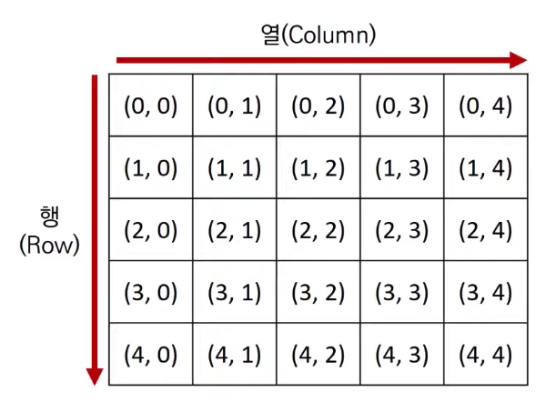
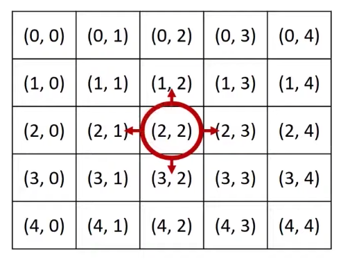
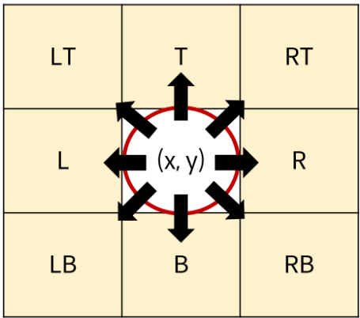

# 구현(Implementation)
    문제에 제시된 풀이 과정을 그대로 구현하는 유형

- 일반적으로 알고리즘 문제에서의 2차원 공간은 **행렬(matrix)**의 의미로 사용한다.



```python
for i in range(5):
    for j in range(5):
        print('(', i ',', j ')', end=' ')
    print()
```

- 시뮬레이션 및 완전 탐색 문제에서는 2차원 공간에서의 **방향 벡터**가 자주 활용된다.



```python
# 동, 북, 서, 남
dx = [0, -1, 0, 1]
dy = [1, 0, -1, 0]

# 현재 위치
x, y = 2, 2

for i in range(4):
    # 다음 위치
    nx = x + dx[i]
    ny = y + dy[i]
    print(nx, ny)
```

- 델타 탐색의 8방향(상하좌우 + 대각선)도 자주 활용된다.



```python
# 8방향 델타값
direction = {
    "R": (0, 1),
    "L": (0, -1),
    "B": (1, 0),
    "T": (-1, 0),
    "RT": (-1, 1),
    "LT": (-1, -1),
    "RB": (1, 1),
    "LB": (1, -1)
}
```