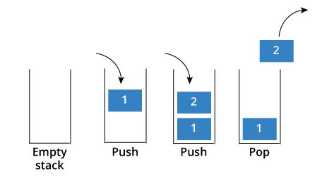
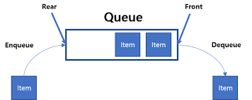
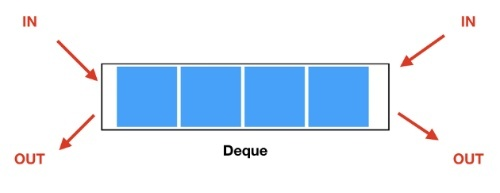
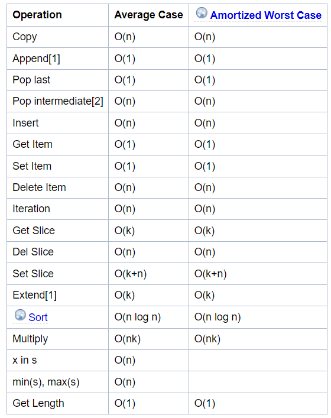
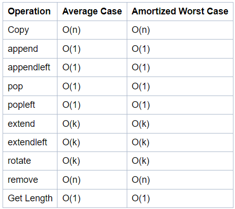

# 1. 스택(Stack)
- stack은 쌓는다는 의미
- 접시를 쌓고 빼듯이 **데이터를 한 쪽에서만  넣고 빼는 자료 구조**
- 가장 마지막에 들어온 데이터가 가장 먼저 나가므로 **LIFO(Last-in First-out, 후입선출)방식**

- Push : 스택에 새로운 데이터를 삽입하는 행위
- Pop : 스택의 가장 마지막 데이터를 가져오는 행위

## 스택(stack)을 왜/언제 사용하는지
- 이전 작업의 기억(뒤집기, 되돌리기, 되돌아가기)
- 브라우저 히스토리, ctrl+z, 단어 뒤집기

## 리스트(list)로 간편하게 스택 사용하기
- push => append
- pop => pop
- list[0](가장 오래된 데이터)부터 list[-1](가장 최신 데이터, 데이터 추가와 삭제)까지

# 2. 큐(Queue)
- **한 쪽 끝에서 데이터를 넣고, 다른 한 쪽에서만 데이터를 뺄 수 있는 자료 구조**
- 가장 먼저 들어온 데이터가 가장 먼저 나가므로 **FIFO(First-in First-out, 선입선출)방식**

- Enqueue : 큐의 맨 뒤에서 데이터를 삽입하는 행위
- Dequeue : 큐의 맨 앞에서 데이터를 가져오는 행위

## 큐(queue)를 왜/언제 사용해야 하는지
- 순서와 대기
- 프로세스 관리(데이터 버퍼)
- 클라이언트 / 서버(Message Queue)

## 리스트(list)로 간편하게 큐 사용하기
- enqueue => append
- dequeue => pop
- list[0](가장 오래된 데이터, 데이터 추가)부터 list[-1](가장 최신 데이터, 데이터 삭제)까지

## 리스트를 이용한 큐 자료구조의 단점
- 데이터를 뺄 때 큐 안에 있는 데이터가 많은 경우, 비효율적임
- 맨 앞 데이터가 빠지면서 리스트의 인덱스가 하나씩 당겨지기 때문

## 덱(Deque, Double-Ended Queue) 자료 구조
- **양 방향**으로 삽입과 삭제가 자유로운 큐
- 덱은 양 방향 삽입, 추출이 모두 큐보다 훨씬 빠름(시간을 크게 단축시킬 수 있음)
- 큐를 리스트로 이용했을 때의 단점을 보완시켜 줌

## 리스트와 덱의 시간복잡도

### 1. 리스트 시간 복잡도

### 2. 덱 시간 복잡도

