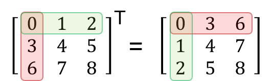

# 이차원 리스트
    - 리스트를 원소로 가지는 리스트이다.
    - 이차원 리스트는 행렬(matrix)이다.
```python
matrix = [[1, 2, 3], [4, 5, 6], [7, 8, 9]]

print(matrix[0])
# [1, 2, 3]
print(matrix[1])
# [4, 5, 6]
print(matrix[2])
# [7, 8, 9]

print(matrix[0][0])
# 1
print(matrix[1][2])
# 6
print(matrix[2][0])
# 7
```

```python
matrix = [[1, 2, 3], [4, 5, 6], [7, 8, 9]]

matrix = [   # matrix를 행렬처럼 변경
    [1, 2, 3],
    [4, 5, 6],
    [7, 8, 9]
]
```

## 특정 값으로 초기화된 이차원 리스트 만들기
1. 직접 작성(4*3 행렬)
```python
matrix1 = =[[0, 0, 0], [0, 0, 0], [0, 0, 0], [0, 0, 0]]

matrix2 = [   # matrix를 행렬처럼 변경
    [0, 0, 0],
    [0, 0, 0],
    [0, 0, 0],
    [0, 0, 0]
]
```

2. 반복문으로 작성(100*100 행렬)
```python
matrix = []

for _ in range(100):
    matrix.append([0] * 100)
```

3. 반복문으로 작성(n*m 행렬)
```python
n = 4 # 행
m = 3 # 열
matrix = []

for _ in range(n):
    matrix.append([0] * m)

print(matrix)
# [[0, 0, 0], [0, 0, 0], [0, 0, 0], [0, 0, 0]]
```

4. 리스트 컴프리헨션으로 작성(n*m 행렬)
```python
n = 4 # 행
m = 3 # 열

matrix = [[0] * m for _ in range(n)]

print(matrix)
# [[0, 0, 0], [0, 0, 0], [0, 0, 0], [0, 0, 0]]
```

## 리스트 컴프리헨션과 리스트 곱셈 연산의 차이점
```python
n = 4 # 행
m = 3 # 열

matrix1 = [[0] * m for _ in range(n)]
matrix2 = [[0]* m] * n

matrix1[0][0] = 1
matrix2[0][0] = 1

print(matrix1)
# [[1, 0, 0], [0, 0, 0], [0, 0, 0], [0, 0, 0]]
print(matrix1)
# [[1, 0, 0], [1, 0, 0], [1, 0, 0], [1, 0, 0]]
```

## 입력 받기
### 1. 행렬의 크기가 미리 주어지는 경우
```python
# 문제에 8*8의 행렬 크기가 주어짐
matrix = []

for _ in range(8):
    line = list(input()) # 문자열인 경우
    matrix.append(line)

# 위의 코드를 리스트 컴프리헨션으로
matrix = [list(input()) for _ in range(8)]
```
```python
'''
3 * 3 크기의 입력 받기
1 2 3
4 5 6
7 8 9
'''
matrix = []

for _ in range(3):
    line = list(map(int, input().split())) # 숫자인 경우
    matrix.append(line)

# 위의 코드를 리스트 컴프리헨션으로
matrix = [list(map(int, input().split())) for _ in range(3)]
```

### 2. 행렬의 크기가 입력으로 주어지는 경우
```python
n, m = map(int, input().split()) # 8 7
matrix = []

for _ in range(n):
    line = list(map(int, input().split()))
    matrix.append(line)

# 위의 코드를 리스트 컴프리헨션으로
n, m = map(int, input().split()) # 8 7
matrix = [list(map(int, input().split())) for _ in range(n)]
```
```python
'''
n * m 크기의 입력 받기
3 4
1 2 3 4
5 6 7 8
9 0 1 2
'''
n, m = map(int, input().split()) # 3 4
matrix = []

for _ in range(n):
    line = list(map(int, input().split()))
    matrix.append(line)

# 위의 코드를 리스트 컴프리헨션으로
matrix = [list(map(int, input().split())) for _ in range(n)]
```


## 순회
### 1. 이중 for문을 이용한 행 우선 순회
```python
matrix = [
    [1, 2, 3, 4],
    [5, 6, 7, 8],
    [9, 0, 1, 2]
]

for i in range(3): # 행
    for j in range(4): # 열
        print(matrix[i][j], end=' ')
    print()

# 1 2 3 4
# 5 6 7 8
# 9 0 1 2
```
```python
# 행 우선 순회를 이용해 이차원 리스트의 총합 구하기
# 방법 1
matrix = [
    [1, 1, 1, 1],
    [1, 1, 1, 1],
    [1, 1, 1, 1]
]

total = 0

for i in range(3):
    for j in range(4):
        total += matrix[i][j]

print(total)

# 12
#=============================

# 방법 2
matrix = [
    [1, 1, 1, 1],
    [1, 1, 1, 1],
    [1, 1, 1, 1]
]

total = sum(map(sum, matrix))

print(total)

# 12
```
```python
# 행 우선 순회를 이용해 이차원 리스트의 최대값, 최소값 구하기
# 최대값
matrix = [
    [0, 5, 3, 1],
    [4, 6, 10, 8],
    [9, -1, 1, 5]
]

max_value = 0

for i in range(3):
    for j in range(4):
        if matrix[i][j] > max_value:
            max_value = matrix[i][j]

print(max_value)

# 10
#=============================

# 최대값
matrix = [
    [0, 5, 3, 1],
    [4, 6, 10, 8],
    [9, -1, 1, 5]
]

max_value = 99999999

for i in range(3):
    for j in range(4):
        if matrix[i][j] < min_value:
            min_value = matrix[i][j]

print(min_value)

# -1
#=============================

# 다른 방법으로 최대, 최소값 구하기
matrix = [
    [0, 5, 3, 1],
    [4, 6, 10, 8],
    [9, -1, 1, 5]
]

max_value = max(map(max, matrix))
min_value = min(map(min, matrix))

print(max_value)
# 10

print(min_value)
# -1
```


### 2. 이중 for문을 이용한 열 우선 순회
```python
matrix = [
    [1, 2, 3, 4],
    [5, 6, 7, 8],
    [9, 0, 1, 2]
]

for i in range(4): # 열
    for j in range(3): # 행
        print(matrix[j][i], end=' ')
    print()

# 1 5 9
# 2 6 0
# 3 7 1
# 4 8 2
```


## 전치(transpose)
    행렬의 행과 열을 서로 맞바꾸는 것

```python
matrix = [
    [1, 2, 3, 4],
    [5, 6, 7, 8],
    [9, 0, 1, 2]
]

# 전치 행렬을 담을 이차원 리스트 초기화(행과 열의 크기가 반대)
transpose_matrix = [[0] * 3 for _ in range(4)]

for i in range(4):
    for j in range(3):
        transpose_matrix[i][j] = matrix[j][i] # 행, 열 맞바꾸기
    print()

'''
transpose_matrix = [
    [1, 5, 9],
    [2, 6, 0],
    [3, 7, 1],
    [4, 8, 2]
]
'''
```

## 회전
    이차원 리스트를 왼쪽, 오른쪽으로 회전하는 경우
```python
# 왼쪽으로 90도 회전하기
matrix = [
    [1, 2, 3],
    [4, 5, 6],
    [7, 8, 9]
]

n = 3
rotate_matrix = [[0] * n for _ in range(n)]

for i in range(n):
    for j in range(n):
        rotate_matrix[i][j] = matrix[j][n-i-1]
    print()

'''
rotate_matrix = [
    [3, 6, 9],
    [2, 5, 8],
    [1, 4, 7]
]
'''

# 오른쪽으로 90도 회전하기
matrix = [
    [1, 2, 3],
    [4, 5, 6],
    [7, 8, 9]
]

n = 3
rotate_matrix = [[0] * n for _ in range(n)]

for i in range(n):
    for j in range(n):
        rotate_matrix[i][j] = matrix[n-j-1]][i]
    print()

'''
rotate_matrix = [
    [7, 4, 1],
    [8, 5, 2],
    [9, 6, 3]
]
'''
```