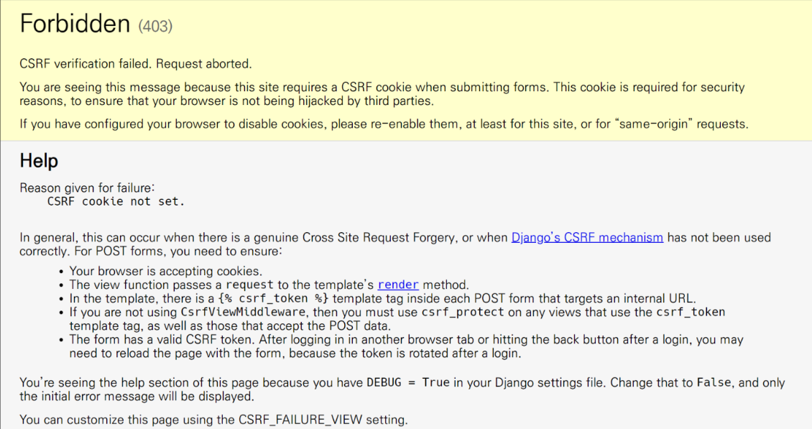
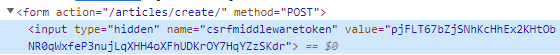
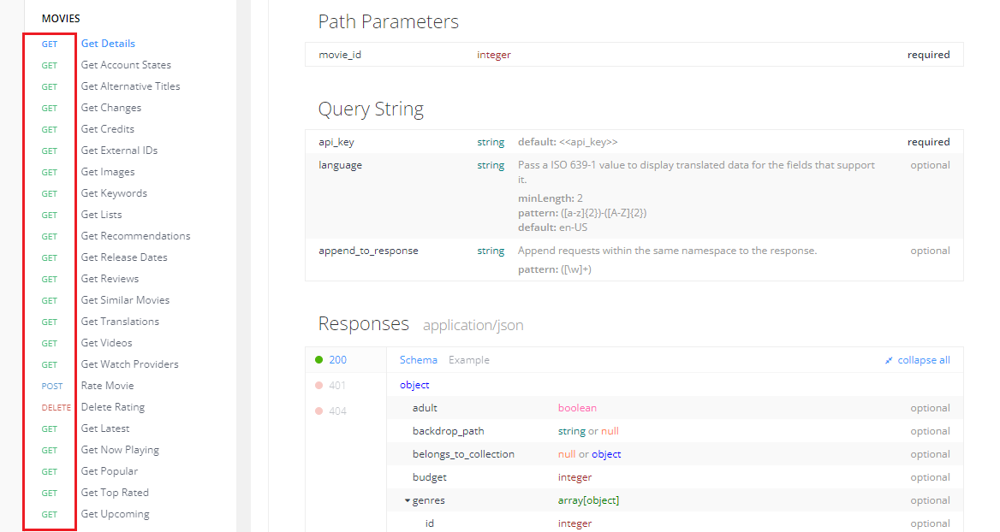

# ORM with view

## 사전 준비
### app urls 분할 및 연결

```python
# articles/urls.py

from django.urls import path

app_name = 'articles'
urlpatterns = [
    
]
```
```python
# crud/urls.py

from django.contrib import admin
from django.urls import path, include

urlpatterns = [
    path('admin/', admin.site.urls),
    path('articles/', include('articles.urls')),
]
```

### index 페이지 작성
```python
# articles/urls.py

from django.urls import path
from . import views

app_name = 'articles'
urlpatterns = [
    path('', views.index, name='index'),
]
```
```python
# articles/views.py

def index(request):
    return render(request, 'articles/index.html')
```
```html
<!-- articles/index.html -->
<!-- body 태그 생략 -->

<h1>Articles</h1>
```

## READ(조회)

### 1. 전체 게시글 조회
```python
# articles/views.py

from .models import Article

def index(request):
    # DB에 전체 게시글 조회를 요청
    articles = Article.objects.all()
    context = {
        'articles': articles,
    }
    return render(request, 'articles/index.html', context)
```
```html
<!-- articles/index.html -->

<h1>Articles</h1>
<hr>

    <p>글 번호: <a href="">{{article.pk}}</a></p>
    <p>글 제목: {{article.title}}</p>
    <p>글 내용: {{article.content}}</p>
    <hr>

```

### 2. 단일 게시글 조회
```python
# articles/urls.py

app_name = 'articles'
urlpatterns = [
    ...
    path('<int:pk>/', views.detail, name='detail'),
]
```
```python
# articles/views.py

def detail(request, pk):
    article = Article.objects.get(pk=pk) # 왼쪽 pk: 컬럼, 오른쪽 pk: request 쪽 pk
    context = {
        'article': article,
    }
    return render(request, 'articles/detail.html', context)
```
```html
<!-- articles/detail.html -->

<h1>Detail</h1>
<hr>
<p>글 번호: {{article.pk}}</p>
<p>제목: {{article.title}}</p>
<p>내용: {{article.content}}</p>
<p>작성일: {{article.created_at}}</p>
<p>수정일: {{article.updated_at}}</p>
<hr>
<a href="">[back]</a>
```

## CREATE
- create 로직을 구현하기 위해 필요한 view 함수
    1. new
    2. create

### 1. new
- 사용자의 입력을 받는 페이지를 렌더링

### new 로직 작성
```python
# articles/urls.py

app_name = 'articles'
urlpatterns = [
    ...
    path('new/', views.new, name='new'),
]
```
```python
# articles/views.py

def new(request):
    return render(request, 'articles/new.html')
```
```html
<!-- articles/new.html -->

<h1>New</h1>
<a href="">[메인 페이지]</a>
<form action="" method="GET">
    <div>
        <label for="title">제목:</label>
        <input type="text" name="title" id='title'>
    </div>
    <div>
        <label for="title">내용:</label>
        <textarea name="content" id="content" cols="30" rows="10"></textarea>
    </div>
    <input type="submit">
</form>
```

### 2. create
- 사용자가 입력한 데이터를 받아 DB에 저장

### create 로직 작성
```python
# articles/urls.py

app_name = 'articles'
urlpatterns = [
    ...
    path('create/', views.create, name='create'),
]
```
```python
# articles/views.py

def create(request):
    # new에서 보낸 사용자 데이터를 받아서 변수에 할당
    title = request.GET.get('title')
    content = request.GET.get('content')

    # 받은 데이터를 DB에 저장(3가지 방법)
    # 1.
    # article = Article()
    # article.title = title
    # article.content = content
    # article.save()

    # 2. 2번이 가장 우수함
    article = Article(title=title, content=content)
    # 저장 전에 유효성 검사와 같은 추가 작업을 위해 2번 방법을 택함
    article.save()

    # 3.
    # Article.objects.create(title=title, content=content)

    # 결과 페이지 반환
    return render(request, 'articles/create.html')
```
```html
<!-- articles/create.html -->

<h1>게시글이 문제없이 작성되었습니다.</h1>
```

## HTTP request methods
- create 로직 결과 게시글 작성 후 작성 완료를 나타내는 페이지를 렌더링하는 것
    - 게시글을 "조회해줘!"라는 요청이 아닌 "작성해줘!"라는 요청이기 때문에 페이지 렌더링은 적절한 응답이 아님

### redirect()
- 인자에 작성된 주소로 다시 요청을 보냄
- 데이터 저장 후 유저를 어디론가 보내야 한다.

```python
# redirect 함수 적용
from django.shortcuts import render, redirect

# create view 함수 수정
def create(request):
    title = request.GET.get('title')
    content = request.GET.get('content')
    article = Article(title=title, content=content)
    article.save()
    return redirect('articles:detail', article.pk)
```

### HTTP
- 네트워크 상에서 데이터를 주고 받기위한 약속

### HTTP request methods
- 데이터(리소스)에 어떤 요청(행동)을 원하는지를 나타내는 것
- method
    - GET
    - POST

#### GET Method
- 특정 리소스를 조회하는 요청
- GET으로 데이터를 전달하면 Query String 형식으로 보내짐
- **반드시 데이터를 가져올 때만 사용해야 함**

#### POST Method
- 특정 리소스에 변경사항을 만드는 요청
- POST로 데이터를 전달하면 HTTP Body에 담겨 보내짐
- DB에 대한 변경사항을 만드는 요청이기 때문에 토큰을 사용해 최소한의 신원 확인을 하는 것

#### POST method 적용

```html
<h1>New</h1>
<a href="">[메인 페이지]</a>
<form action="" method="POST">
    
    <div>
        <label for="title">제목:</label>
        <input type="text" name="title" id='title'>
    </div>
    <div>
        <label for="title">내용:</label>
        <textarea name="content" id="content" cols="30" rows="10"></textarea>
    </div>
    <input type="submit">
</form>
```
```python
def create(request):
    title = request.POST.get('title')
    content = request.POST.get('content')
    ...
```

#### 게시글 작성 후 403 응답 확인



### HTTP response status code
- 특정 HTTP 요청이 성공적으로 완료되었는지 알려줌
- 5개의 그룹으로 나뉘어짐
    - 1xx, 2xx, 3xx, 4xx, 5xx
    - https://developer.mozilla.org/en-US/docs/Web/HTTP/Status

### 403 Forbidden
- 서버에 요청이 전달되었지만, 권한 때문에 거절됨
- "CSRF token이 누락되었다"

### CSRF(Cross-Site-Request-Forgery)
- "사이트 간 요청 위조"
- 사용자가 자신의 의지와 무관하게 공격자가 의도한 행동을 하여 특정 웹 페이지를 보안에 취약하게 하거나 수정, 삭제 등의 작업을 하게 만드는 공격 방법

### Security Token (CSRF Token)
- "대표적인 CSRF 방어 방법"
1. 서버는 사용자 입력 데이터에 임의의 난수 값(token)을 부여
2. 매 요청마다 해당 token을 포함시켜 전송 시키도록 함
3. 이후 서버에서 요청을 받을 때마다 전달된 token이 유효한지 검증

```html
...
<form action="" method="POST">
    
...
```



- DTL의 **csrf_token 태그**를 사용해 사용자에게 토큰 값을 부여
- 요청 시 토큰 값도 함께 서버로 전송될 수 있도록 함

## DELETE

### DELETE 로직 작성

```python
urlpatterns = [
    ...
    path('<int:pk>/delete/', views.delete, name='delete'),
]
```
```python
def delete(request, pk):
    # 삭제할 데이터 조회
    article = Article.objects.get(pk=pk)
    # 조회한 데이터 삭제(delete)
    article.delete()
    # 전체 조회 페이지로 이동
    return redirect('articles:index')
```
```html
...
<form action="" method="POST">
    
    <input type="submit" value="삭제">
</form>
...
```

## UPDATE
- update 로직을 구현하기 위해 필요한 view 함수
    - edit
    - update

### edit
- 사용자의 입력을 받는 페이지를 렌더링

### edit 로직 작성
```python
urlpatterns = [
    ...
    path('<int:pk>/edit/', views.edit, name='edit'),
]
```
```python
def edit(request, pk):
    article = Article.objects.get(pk=pk)
    context = {
        'article': article,
    }
    return render(request, 'articles/edit.html', context)
```

<br>

- **수정 시, 이전 데이터가 출력 될 수 있도록 처리**

```html
...
<h1>Edit</h1>
<a href="">[메인 페이지]</a>
<form action="#" method="POST">
    
    <div>
        <label for="title">제목:</label>
        <input type="text" name="title" id='title' value="{{article.title}}">
    </div>
    <div>
        <label for="title">내용:</label>
        <textarea name="content" id="content" cols="30" rows="10">{{article.content}}</textarea>
    </div>
    <input type="submit" value="수정">
</form>
...
```


### update
- 사용자가 입력한 데이터를 받아 DB에 저장

### update 로직 작성
```python
urlpatterns = [
    ...
    path('<int:pk>/update/', views.update, name='update'),
]
```
```python
def update(request, pk):
    # 수정 작업
    # 1. 데이터 조회
    article = Article.objects.get(pk=pk)
    # 2. 데이터 수정
    article.title = request.POST.get('title')
    article.content = request.POST.get('content')
    # 3. 데이터 저장
    article.save()
    return redirect('articles:detail', article.pk)
```
```html
...
<h1>Edit</h1>
<a href="">[메인 페이지]</a>
<!-- edit.html action 부분에 추가 -->
<form action="" method="POST">
    
    <div>
        <label for="title">제목:</label>
        <input type="text" name="title" id='title' value="{{article.title}}">
    </div>
    <div>
        <label for="title">내용:</label>
        <textarea name="content" id="content" cols="30" rows="10">{{article.content}}</textarea>
    </div>
    <input type="submit" value="수정">
</form>
...
```
---

<br>

## 참고

### HTTP request methods 사용 예시
- 출처 : TMDB API



### POST & DELETE
- (POST) : articles/1/ => 1번 게시글 생성
- (DELETE) : articles/1/ => 1번 게시글 삭제