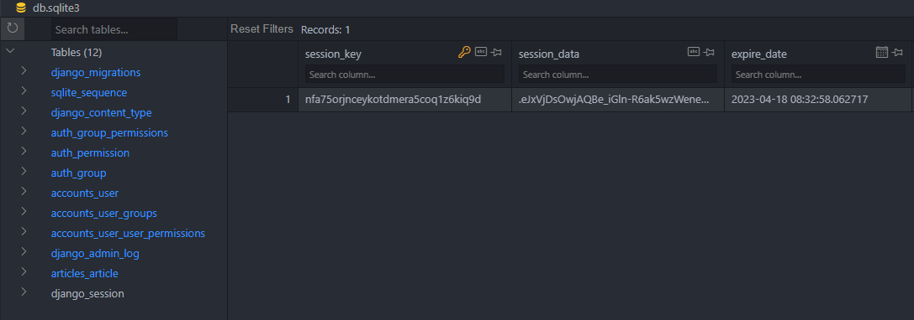
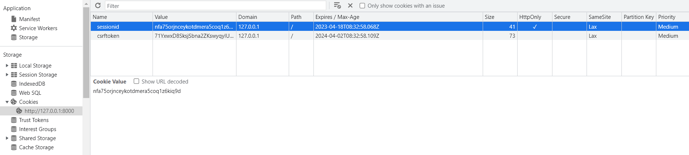
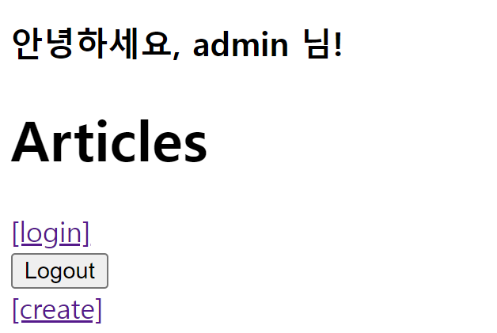
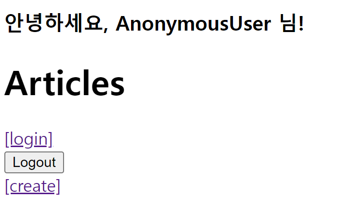

# Django Authentication System
    - 사용자 인증과 관련된 기능을 모아 놓은 시스템
    - 인증과 권한 부여를 함께 제공 및 처리

```python
INSTALLED_APPS = [
    ...
    'django.contrib.auth',
    ...
]
```

## Authentication
- 사용자가 자신이 누구인지 확인하는 것
- 신원 확인

## Authorization
- 인증된 사용자가 수행할 수 있는 작업을 결정
- 권한 부여

## 사전 설정
- 두 번째 app accounts 생성 및 등록
- **auth와 관련된 경로나 키워드들을 django 내부적으로 accounts라는 이름으로 사용하고 있기 때문에 되도록 accounts로 지정하는 것을 권장**

```python
# accounts/urls.py

from django.urls import path
from . import views

app_name = 'accounts'
urlpatterns = [
    
]
```
```python
# project_name/urls.py

urlpatterns = [
    ...
    path('accounts/', include('accounts.urls')),
]
```

## Custom User medel로 대체하기
- django가 기본적으로 제공하는 User model은 내장된 auth 모듈의 User 클래스를 사용
- **별도의 설정 없이 사용할 수 있어 간편하지만, 직접 수정할 수 없는 문제**
- https://github.com/django/django/blob/main/django/contrib/auth/models.py#L405

### 대체하기(1/3)
- AbstractUser를 상속받는 커스텀 User 클래스 작성
- 기존 User 클래스도 AbstractUser를 상속받기 때문에 커스텀 User 클래스도 완전히 같은 모습을 가지게 됨

```python
# accounts/models.py

from django.db import models
from django.contrib.auth.models import AbstractUser

class User(AbstractUser):
    pass
```

### 대체하기(2/3)
- django 프로젝트가 사용하는 기본 User 모델을 우리가 작성한 User 모델로 지정
    - 수정 전 기본 값은 'auth.User'

```python
# settings.py

AUTH_USER_MODEL = 'accounts.User'
```

### 대체하기(3/3)
- 기본 User 모델이 아니기 때문에 등록하지 않으면 admin site에 출력되지 않음

```python
# accounts/admin.py

from django.contrib import admin
from django.contrib.auth.admin import UserAdmin
from .models import User

admin.site.register(User, UserAdmin)
```

- 기존 User 테이블의 변화
    - auth_user -> accounts_user로 변경됨

### 주의!
- 프로젝트 중간에 AUTH_USER_MODEL을 변경할 수 없음
- 이미 진행한 경우, 데이터베이스 초기화 후 진행 필요

## Login
- session을 create하는 과정

### AuthenticationForm()
- 로그인을 위한 built-in form

### 로그인 페이지 작성

```python
# accounts/urls.py

app_name = 'accounts'
urlpatterns = [
    path('login/', views.login, name='login'),
]
```
```python
# accounts/views.py
from django.contrib.auth.forms import AuthenticationForm
from django.contrib.auth import login as auth_login

def login(request):
    if request.method == 'POST':
        form = AuthenticationForm(request, request.POST)
        if form.is_valid():
            auth_login(request, form.get_user())
            return redirect('articles:index')
    else:
        form = AuthenticationForm()
    context = {
        'form': form,
    }
    return render(request, 'accounts/login.html', context)
```
```html
<!-- accounts/login.html -->
<h1>Login</h1>
<form action="" method='POST'>
    
    {{ form.as_p }}
    <input type="submit">
</form>
```

### login(request, user)
- 인증된 사용자를 로그인하는 함수

### get_user()
- AuthenticationForm의 인스턴스 메서드 유효성 검사를 통과했을 경우, 로그인 한 사용자 객체를 반환

### 세션 데이터 확인하기
- 로그인 후 개발자 도구와 DB에서 django로부터 발급받은 세션 확인
    - 로그인은 관리자 계정을 만든 후 진행

1. django_session 테이블에서 확인

    

2. 브라우저에서 확인
    - 개발자도구 - Application - Cookies

    

### 로그인 링크 작성

```html
<!-- articles/index.html -->
...
<a href="">[login]</a>
...
```

## Logout
- Session을 DELETE하는 과정

### logout(request)
1. 현재 요청에 대한 session data을 DB에서 삭제
2. 클라이언트의 쿠키에서도 session id를 삭제

### 로그아웃 로직 작성

```python
# accounts/urls.py

app_name = 'accounts'
urlpatterns = [
    path('login/', views.login, name='login'),
    path('logout/', views.logout, name='logout'),
]
```
```python
# accounts/views.py
from django.contrib.auth.forms import AuthenticationForm
from django.contrib.auth import logout as auth_logout

def logout(request):
    auth_logout(request)
    return redirect('articles:index')
```
```html
<!-- articles/index.html -->

<h1>Articles</h1>
<form action="" method='POST'>
    
    <input type="submit" value='Logout'>
</form>
```

## Template with Authentication data
- 템플릿에서 인증 관련 데이터를 출력하는 방법

### 현재 로그인 되어있는 유저 정보 출력하기

```html
<!-- articles/index.html -->
...
<h3>안녕하세요, {{ user }} 님!</h3>
...
```





### context processors
- 템플릿이 렌더링될 때 호출 가능한 컨텍스트 데이터 목록
- 작성된 컨텍스트 데이터는 기본적으로 템플릿에서 사용 가능한 변수로 포함됨
- 즉, django에서 자주 사용하는 데이터 목록을 미리 템플릿에 로드 해 둔 것

```python
# settings.py

TEMPLATES = [
    {
        ...
        'OPTIONS': {
            'context_processors': [
                'django.template.context_processors.debug',
                'django.template.context_processors.request',
                'django.contrib.auth.context_processors.auth',
                'django.contrib.messages.context_processors.messages',
            ],
        },
    },
]
```

---

<br>

## 참고

### User 모델 상속 관계
- models.Model -> class AbstractBaseUser -> class AbstractUser -> class User

### 'AbstractUser' class
- 관리자 권한과 함께 완정한 기능을 가지고 있는 User model을 구현하는 추상 기본 클래스
- AbstractBaseUser (추상 기본 클래스)
    - 몇 가지 공통 정보를 여러 다른 모델에 넣을 때 사용하는 클래스
    - 데이터베이스 테이블을 만드는 데 사용되지 않으며, 대신 다른 모델의 기본 클래스로 사용되는 경우 해당 필드가 하위 클래스의 필드에 추가 됨
    - https://docs.python.org/3/library/abc.html