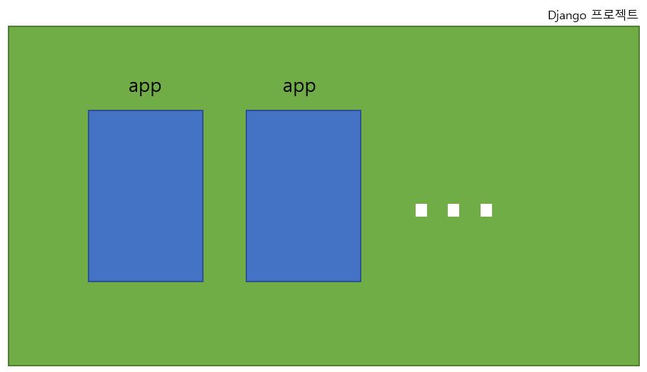

# django 프로젝트와 앱

## django project
    - 애플리케이션의 집합
    - DB 설정, URL 연결, 전체 앱 설정 등을 처리



## django application
    - 독립적으로 작동하는 기능 단위 모듈
    - 각자 특정한 기능을 담당하며 다른 앱들과 함께 하나의 프로젝트를 구성
    - MTV 패턴에 해당하는 파일 및 폴더를 담당

## 만약 블로그를 만든다면
- 프로젝트
    - 블로그
    - 전체 설정 담당

- 앱
    - 게시글, 댓글, 카테고리 회원 관리 등
    - DB, 로직, 화면

## 명령어
- 앱 생성
    - **앱의 이름은 '복수형'으로 지정하는 것을 권장**

```
$ python manage.py startapp articles
```

- 앱 등록
    - **반드시 앱을 생성한 후에 등록해야 함**
    - **반대로 등록 후 생성은 불가능**

```python
# settings.py

INSTALLED_APPS = [
    # 앱 등록 권장 순서
    # 1. local app
    'articles',
    # 2. 3rd party app (설치를 통해 추가하는 앱)
    # 3. 기본 django app
    'django.contrib.admin',
    'django.contrib.auth',
    'django.contrib.contenttypes',
    'django.contrib.sessions',
    'django.contrib.messages',
    'django.contrib.staticfiles',
]
```

# django 디자인 패턴
    - 소프트웨어 설계에서 발생하는 문제를 해결하기 위한 일반적인 해결책
    - 공통적인 문제를 해결하는데 쓰이는 형식화 된 관행

## MVC 디자인 패턴
- Model-View-Controller
- 애플리케이션을 구조화하는 대표적인 패턴
- 데이터, 사용자 인터페이스, 비즈니스 로직을 분리
- **독립적, 쉬운 유지보수**


## MTV 디자인 패턴
- Model-Template-View
- django에서 애플리케이션을 구조화하는 패턴
- 기존 MVC 패턴과 동일하나 명칭을 다르게 정의
- View -> Template
- Controller -> View

## 프로젝트 구조
1. 봐야할 것
- settings.py
    - 프로젝트의 모든 설정을 관리
- urls.py
    - URL과 이에 해당하는 적절한 views를 연결

2. 안봐도 될 것
- __init__.py (init을 기준으로 underscore 2개)
    - 해당 폴더를 패키지로 인식하도록 설정
- asgi.py
    - 비동기식 웹 서버와의 연결 관련 설정
- wsgi.py
    - django 프로젝트와 다양한 방법으로 상호작용하는 커맨드라인 유틸리티
- **모두 현재 단계에서는 별도로 수정하지 않음**

## 앱 구조
1. 봐야할 것
- admin.py
    - 관리자용 페이지 설정
- models.py
    - DB와 관련된 model을 정의
    - MTV 패턴의 M
- views.py
    - HTTP 요청을 처리하고 해당 요청에 대한 응답을 반환
    - url, mode, template과 연계
    - MTV 패턴의 V

2. 안봐도 될 것
- apps.py
    - 앱의 정보가 작성된 곳
- tests.py
    - 프로젝트 테스트 코드를 작성하는 곳
- **모두 현재 단계에서는 별도로 수정하지 않음**


<br>

# 요청과 응답

## urls
- http://128.0.0.1:8000/articles/ 로 요청이 왔을 때 views 모듈의 idex 뷰 함수를 호출

```python
# urls.py
# urls.py 입장에서는 articles 패키지에서 views 모듈을 가져오는 것

from django.contrib import admin
from django.urls import path
from articles import views

urlpatterns = [
    path('admin/', admin.site.urls),
    path('articles/', views.index),
]
```

## views
- 특정 경로에 있는 templates와 request 객체를 결합
- 응답 객체를 반환하는 index view 함수 정의
- **모든 view 함수는 첫 번째 인자로 요청 객체를 필수적으로 받음**

```python
# views.py

from django.shortcuts import render

def index(request):
    return render(request, 'articles/index.html')
```

## templates
1. articles 앱 폴더 안에 templates 폴더 작성
2. templates 폴더 안에 템플릿 페이지 작성

- **반드시 templates 폴더명이어야 하며 개발자가 직접 생성해야 함**

```html
<!-- articles/index.html -->

<!DOCTYPE html>
<html lang="en">
<head>
    ...
    <title>Document</title>
</head>
<body>
    <h1>Hello, django</h1>
</body>
</html>
```

## django에서 templates을 인식하는 경로 규칙
- **app 폴더 / templates /** articles / index.html
- **app 폴더 / templates /** example.html
- django는 templates / 까지 기본 경로로 인식하므로 그 이후로는 직접 작성

## 데이터 흐름에 따른 코드 작성
### urls -> views -> templates

---

<br>

# 참고
## MTV 디자인 패턴 정리
- Model
    - 데이터와 관련되 로직을 관리
    - 응용프로글매의 데이터 구조를 정의하고 데이터베이스의 기록을 관리

- Template
    - 레이아웃과 화면을 처리
    - 화면상의 사용자 인터페이스 구조와 레이아웃을 정의

- View
    - Model & Template과 관련된 로직을 처리해서 응답을 반환
    - 클라이언트의 요청에 대해 처리를 분기하는 역할

## render 함수
```python
render(request, template_name, context)

# 1. request : 응답을 생성하는 데 사용되는 요청 객체
# 2. template_name : 템플릿 이름의 경로
# 3. context : 템플릿에서 사용할 데이터 (딕셔너리 타입으로 작성)
```
- 주어진 템플릿을 context 데이터와 결합하고 렌더링 된 텍스트와 함께 응답 객체를 반환하는 함수