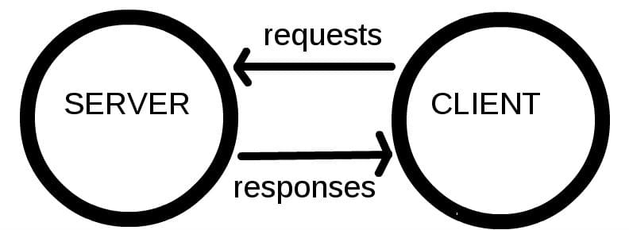

# Framework
    웹 애플리케이션을 빠르게 개발할 수 있도록 도와주는 도구
    (개발에 필요한 기본 구조, 규칙, 라이브러리 등을 제공)

## 왜 프레임워크를 사용할까?
- 기본적인 구조와 규칙을 제공하기 때문에 필수적인 개발에만 집중 할 수 있음
- 여러 라이브러리를 제공해 개발 속도를 빠르게 할 수 있음
- 유지보수와 확장에 용이해 소프트웨어의 품질을 높임


# django
    Python 기반의 대표적인 웹 프레임워크

# 클라이언트와 서버
## 웹의 동작 방식
- 클라이언트-서버 구조



- Client
    - 서비스를 요청하는 주체
    - 웹 사용자의 인터넷이 연결된 장치, 웹 브라우저

- Server
    - 클라이언트의 요청에 응답하는 주체
    - 웹 페이지, 앱을 저장하는 컴퓨터

### 우리가 웹 페이지를 보게되는 과정
1. 웹 브라우저(클라이언트)에서 'google.com'을 입력
2. 브라우저는 인터넷에 연결된 전세계 어딘 가에 있는 구글 컴퓨터(서버)에게 'Google홈페이지.html'파일을 달라고 요청
3. 요청을 받은 구글 컴퓨터는 데이터베이스에서 'Google홈페이지.html'파일을 찾아 우리 컴퓨터에 응답
4. 전달받은 'Google홈페이지.html'파일을 웹 브라우저가 사람이 볼 수 있도록 해석해주면서 구글의 메인 페이지를 보게 됨
- django를 사용해서 서버(server)를 구현할 것

# django 프로젝트 및 가상환경
## django 프로젝트 생성 전 루틴
```python
# 1. 가상환경(venv) 생성
$ python -m venv venv

# 2. 가상환경 활성화
$ source venv/Scripts/activate

# 3. django 설치
$ pip install django==3.2.18 # 버전을 명시하지 않으면 4.0버전이 설치되니 주의!

# 4. 의존성 파일 생성(패키지 설치시마다 진행)
$ pip freeze > requirements.txt

# 5. django 프로젝트 생성
$ django-admin startproject firstpjt .

# 6. django 서버 실행
$ python manage.py runserver

# 7. http://127.0.0.1:8000/ 접속 후 확인
```

---

# 참고
## django 프로젝트 생성 루틴 정리
1. 가상환경 생성
2. 가상환경 활성화
3. django 설치
4. 의존성 파일 생성
5. .gitignore 파일 생성(첫 add 전에)
6. git 저장소 생성
7. django 프로젝트 생성

## 가상환경을 사용하는 이유
- 의존성 관리
    - 라이브러리 및 패키지를 각 프로젝트마다 독립적으로 사용 가능
- 팀 프로젝트 협업
    - 모든 팀원이 동일한 환경과 의존성 위에서 작업하여 버전간 충돌을 방지

## LTS(Long-Term Support)
- 프레임워크나 라이브러리 등의 소프트웨어에서 장기간 지원되는 안정적인 버전을 의미할 때 사용
- 기업이나 대규모 프로젝트에서는 소프트웨어 업그레이드에 많은 비용과 시간이 필요하기 때문에 안정적이고 장기간 지원되는 버전이 필요

## gitignore 설정 서비스
- https://www.toptal.com/developers/gitignore/