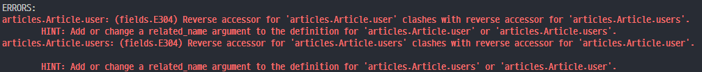

# Many to many relationships (N:M or M:N)
    - 한 테이블의 0개 이상의 레코드가 다른 테이블의 0개 이상의 레코드와 관련된 경우
    - 양쪽 모두에서 N:1 관계를 가짐

## ManyToManyField(to, **options)
- many-to-many 관계 설정 시 사용하는 모델 필드
- 모델 필드의 RelatedManager를 사용하여 관련 개체를 추가, 제거 또는 생성
    - add(), remove(), create(), clear(), ...

### ManyToManyField's Arguments
#### 1. related_name
- 역참조시 사용하는 manager name을 변경

```python
class Patient(models.Model):
    doctors = models.ManyToManyField(Doctor, related_name='patients')
    name = models.TextField()
```
```python
# 변경 전
doctor.patient_set.all()

# 변경 후
doctor.patient.all()
```

#### 2. through
- 중개 테이블을 직접 작성하는 경우, through 옵션을 사용하여 중개 테이블을 나타내는 Django 모델을 지정
- 일반적으로 중개 테이블에 추가 데이터를 사용하는 다대다 관계와 연결하려는 경우(extra data with a many-to-many relationship)에 사용됨

#### 3. symmetrical
- ManyToManyField가 동일한 모델을 가리키는 정의에서만 사용
- 기본 값 : True
- True일 경우
    - _set 매니저를 추가하지 않음
    - source 모델의 인스턴스가 target 모델의 인스턴스를 참조하면 자동으로 target 모델 인스턴스도 source 모델 인스턴스를 자동으로 참조하도록 함(대칭)
    - 즉, 내가 상대방의 친구라면 상대방도 내 친구가 됨
        - ex) SNS 팔로워가 100만명이면 팔로우도 똑같이 100만명이 된다.

- 대칭을 원하지 않는 경우 False로 설정

```python
class Person(models.Model):
    friends = models.ManyToManyField('self')
    # friends = models.ManyToManyField('self', symmetrical=False)
```

### M:N에서의 methods
- add()
    - 지정된 객체를 관련 객체 집합에 추가
    - 이미 존재하는 관계에 사용하면 관계가 복제되지 않음

- remove()
    - 관련 객체 집합에서 지정된 모델 개체를 제거

## Article & User
### Article(M) - User(N)
- 0개 이상의 게시글은 0명 이상의 유저와 관련된다.
- **게시글은 유저로부터 0개 이상의 좋아요를 받을 수 있고, 유저는 0개 이상의 게시글에 좋아요를 누를 수 있다.**

### 모델 관계 설정 (1/5)
- ManyToManyField 작성

```python
# articles/models.py

class Article(models.Model):
    ...
    like_users = models.ManyToManyField(settings.AUTH_USER_MODEL)
    ...
```

### 모델 관계 설정 (2/5)
- Migration 진행 후 에러 확인



### 모델 관계 설정 (3/5)
- like_users 필드 생성 시 자동으로 역참조에는 .article_set 매니저가 생성됨
- 그러나 이전 N:1(Article-User) 관계에서 이미 해당 매니저를 사용 중
    - user.article_set.all() -> 해당 유저가 작성한 모든 게시글 조회
    - user.article_set
        - N:1 => 유저가 작성한 게시글
        - M:N => 유저가 좋아요 한 게시글
- user가 작성한 글들 (user.article_set)과 user가 좋아요를 누른 글(user.article_set)을 구분할 수 없게 됨
    - **related_namager 이름이 충돌**
- user와 관계된 ForeignKey 혹은 ManyToManyField 중 하나에 related_name을 작성해야 함

### 모델 관계 설정 (4/5)
- related_name 작성 후 Migration

```python
# articles/models.py

class Article(models.Model):
    ...
    # related_name='like_articles'로 충돌나지 않게 이름 지정
    like_users = models.ManyToManyField(settings.AUTH_USER_MODEL, related_name='like_articles')
    ...
```

### 모델 관계 설정 (5/5)
- 생성된 중개 테이블 확인(aritcles_article_like_users)

### User - Article간 사용 가능한 related manager 정리
- article.user
    - 게시글을 작성한 유저 - N:1

- user.article_set
    - 유저가 작성한 게시글(역참조) - N:1

- article.like_users
    - 게시글을 좋아요한 유저 - M:N

- user.like_articles
    - 유저가 좋아요한 게시글(역참조) - M:N

### 좋아요 구현 (1/4)
- url 및 view 함수 작성

```python
# articles/urls.py

urlpatterns = [
    ...,
    path('<int:article_pk>/likes/', views.likes, name='likes'),
]
```
```python
# articles/views.py

@login_required
def likes(request, article_pk):
    # 좋아요를 누르는 대상 게시글
    article = Article.objects.get(pk=article_pk)

    # 좋아요 관계를 추가 or 삭제
    # case 1. 현재 좋아요를 요청하는 유저가 해당 게시글의 좋아요를 누른 유저 목록에 있는지 없는지를 확인
    if request.user in article.like_users.all():
    # case 2. 해당 게시글의 좋아요를 누른 유저에서 현재 요청하는 유저의 존재를 조회
    # if article.like_users.filter(pk=request.user.pk).exists():
        # 좋아요 취소
        article.like_users.remove(request.user)
    else:
        # 좋아요 추가
        article.like_users.add(request.user)
    return redirect('articles:index')
```

### 좋아요 구현 (2/4)
- index 템플릿에서 각 게시글을 좋아요 버튼 출력

```html
<!-- articles/index.html -->


    ...
    <form action="" method="POST">
      
      <!-- 현재 좋아요를 요청하는 유저가 게시글의 좋아요를 눌렀다면 -->
      
      <input type="submit" value="좋아요 취소">
      <!-- 현재 좋아요를 요청하는 유저가 게시글의 좋아요를 누르지 않았다면 -->
      
      <input type="submit" value="좋아요">
      
    </form>
  
```

### 좋아요 구현 (3/4)
- 좋아요 버튼 출력 확인

### 좋아요 구현 (4/4)
- 좋아요 버튼 클릭 후 테이블 확인

---

<br>

## 참고
### .exists()
- QuerySet에 결과가 포함되어 있다면 True를 반환하고 그렇지 않다면 False를 반환
- 특히 큰 QuerySet에 있는 특정 개체의 존재와 관련된 검색에 유용

#### exists() 적용
```python
# articles/views.py

# 변경 전

@login_required
def likes(request, article_pk):
    article = Article.objects.get(pk=article_pk)
    if request.user in article.like_users.all():
        article.like_users.remove(request.user)
    else:
        article.like_users.add(request.user)
    return redirect('articles:index')
```
```python
# articles/views.py

# 변경 후

@login_required
def likes(request, article_pk):
    article = Article.objects.get(pk=article_pk)
    if article.like_users.filter(pk=request.user.pk).exists():
        article.like_users.remove(request.user)
    else:
        article.like_users.add(request.user)
    return redirect('articles:index')
```