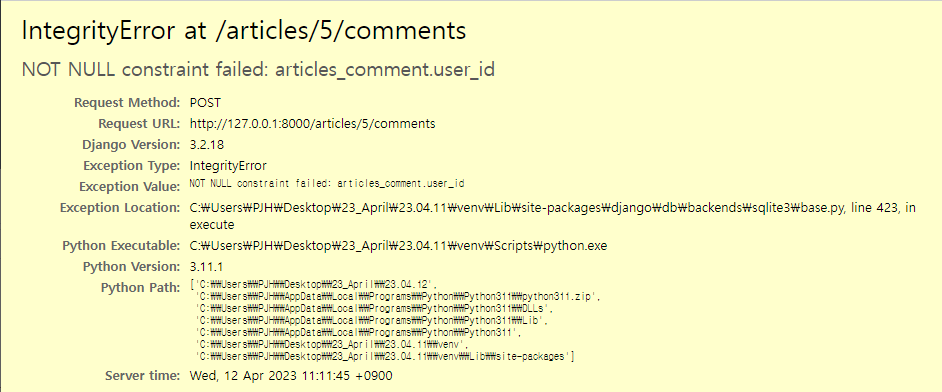

# Many to one relationships

## Article(N) - User(1)
- 0개 이상의 게시글은 1명의 유저에 의해 작성될 수 있음

## Commnet(N) - User(1)
- 0개 이상의 댓글은 1명의 유저에 의해 작성될 수 있음

## Article & User (모델 관계 설정)

### User 외래 키 정의

```python
# articles/models.py

# 직접 참조는 비추천
# from accounts.models import User => User는 객체

# models.py에서 User를 참조할 때만 다음과 같이 (간접)참조한다.
from django.conf import settings

# Create your models here.
class Article(models.Model):
    # settings.AUTH_USER_MODEL는 문자열
    user = models.ForeignKey(settings.AUTH_USER_MODEL, on_delete=models.CASCADE)
    title = models.CharField(max_length=10)
    content = models.TextField()
    created_at = models.DateTimeField(auto_now_add=True)
    updated_at = models.DateTimeField(auto_now=True)
```

### User 모델을 참조하는 2가지 방법
1. get_user_model()
    - 반환 값 : 'User Object' (객체)
    - **models.py가 아닌 다른 모든 곳에서 참조할 때 사용**

2. settings.AUTH_USER_MODEL
    - 반환 값 : 'accounts.User' (문자열)
    - **models.py의 모델 필드에서 참조할 때 사용**

### Migration 진행 (1/4)
- 기본적으로 모든 컬럼은 NOT NULL 제약조건이 있기 때문에 데이터가 없이는 새로 추가되는 외래 키 필드 user_id가 생성되지 않음
- 그래서 기본값을 어떻게 작성할 것인지 선택해야 함
- 1을 입력하고 enter 진행 (다음 화면에서 직접 기본 값 입력)


### Migration 진행 (2/4)
- article의 user_id에 어떤 데이터를 넣을 것인지 직접 입력해야 함
- 마찬가지로 1을 입력하고 enter 진행
- 그러면 기존에 작성된 게시글이 있다면 모두 1번 유저가 작성한 것으로 처리됨 


### Migration 진행 (3/4)
- migration 진행 후, migrate 진행

```
$ python manage.py migrate
```

### Migration 진행 (4/4)
- article 테이블에 user_id 필드 생성됐는 지 확인

## Article & User (CRUD 구현)

### Article CREATE (1/5)
- ArticleForm 출력 확인

### Article CREATE (2/5)
- ArticleForm 출력 필드 수정

```python
# articles/forms.py

from .models import Article, Comment

class ArticleForm(forms.ModelForm):
    class Meta:
        model = Article
        fields = ('title', 'content',)
```

### Article CREATE (3/5)
- 게시글 작성 시 user_id 필드 데이터가 누락되어 에러 발생


### Article CREATE (4/5)
- 게시글 작성 시 작성자 정보가 함께 저장될 수 있도록 save의 commit 옵션 활용

```python
# articles/views.py

@login_required
def create(request):
    if request.method == 'POST':
        form = ArticleForm(request.POST)
        if form.is_valid():
            article = form.save(commit=False)
            article.user = request.user
            article.save()
            return redirect('articles:detail', article.pk)
    else:
        form = ArticleForm()
    context = {
        'form': form,
    }
    return render(request, 'articles/create.html', context)
```

### Article CREATE (5/5)
- 게시글 작성 후 테이블 확인

### Article READ (1/2)
- index 템플릿과 detail 템플릿에서 각 게시글의 작성자 출력 및 확인

```html
<!-- articles/index.html -->


    <p>작성자: {{article.user}}</p>
    <p>제목: 
      <a href="">{{ article.title }}</a>
    </p>
    <p>내용: {{ article.content }}</p>
    <hr>
  
```

### Article READ (2/2)
- index 템플릿과 detail 템플릿에서 각 게시글의 작성자 출력 및 확인

```html
<!-- articles/detail.html -->

<h1>Detail</h1>
<p>글 번호: {{ article.pk }}</p>
<p>제목: {{ article.title }}</p>
<p>내용: {{ article.content }}</p>
<p>작성일: {{ article.created_at }}</p>
<p>수정일: {{ article.updated_at }}</p>
```

### Article UPDATE (1/2)
- 수정을 요청하려는 유저와 게시글을 작성한 유저를 비교하여 본인의 게시글만 수정할 수 있도록 함

```python
# articles/views.py

@login_required
def update(request, article_pk):
    article = Article.objects.get(pk=article_pk)
    # 수정을 요청하는 유저 vs 게시글을 작성한 유저
    if request.user == article.user:
        if request.method == 'POST':
            form = ArticleForm(request.POST, instance=article)
            if form.is_valid():
                form.save()
                return redirect('articles:detail', article.pk)
        else:
            form = ArticleForm(instance=article)
    else:
        return redirect('articles:index')
    context = {
        'article': article,
        'form': form,
    }
    return render(request, 'articles/update.html', context)
```

### Article UPDATE (2/2)
- 해당 게시글의 작성자가 아니라면, 수정/삭제 버튼을 출력하지 않도록 함

```html
<!-- articles/detail.py -->


  <a href="">[UPDATE]</a>
  <form action="" method="POST">
    
    <input type="submit" value="삭제">
  </form>

```

### Article DELETE
- 삭제를 요청하려는 유저와 게시글을 작성한 유저를 비교하여 본인의 게시글만 삭제할 수 있도록 함

```python
# articles/views.py

@login_required
def delete(request, artilce_pk):
    article = Article.objects.get(pk=artilce_pk)
    if request.user == article.user:
        article.delete()
    return redirect('articles:index')
```

## Comment & User (모델 관계 설정)

### User 외래 키 정의

```python
# articles/models.py

from django.conf import settings

class Comment(models.Model):
    # 외래 키 필드
    article = models.ForeignKey(Article, on_delete=models.CASCADE) # CASCADE : 맨 위 게시글이 삭제되면 이 게시글에 작성된 댓글도 삭제됨(게시글이 존재해야 댓글도 존재함)
    user = models.ForeignKey(settings.AUTH_USER_MODEL, on_delete=models.CASCADE)
    content = models.CharField(max_length=200)
    created_at = models.DateTimeField(auto_now_add=True)
    updated_at = models.DateTimeField(auto_now=True)
```

### Migration 진행 (1/2)
- 이전에 Article와 User 모델 관계 설정 때와 마찬가지로 기존에 존재하던 테이블에 새로운 컬럼이 추가되어야 하는 상황이기 때문에 migrations 파일이 곧바로 만들어지지 않고 일련의 과정이 필요

```python
$ python manage.py makemigrations

# ... 공통 과정 생략

$ python manage.py migrate
```

### Migration 진행 (2/2)
- comment 테이블 user_id 필드 생성됐는 지 확인

## Comment & User (CRD 구현)

### Comment CREATE (1/3)
- 댓글 작성 시 user_id 필드 데이터가 누락되어 에러 발생



### Comment CREATE (2/3)
- 댓글 작성 시 작성자 정보가 함께 저장될 수 있도록 save의 commit 옵션 활용

```python
# articles/views.py

@login_required
def comment_create(request, article_pk):
    # 몇 번 게시글인지 조회
    article = Article.objects.get(pk=article_pk)
    # 댓글 데이터를 받아서
    comment_form = CommentForm(request.POST)
    # 유효성 검사
    if comment_form.is_valid():
        # commit=False: 인스턴스는 반환하면서도 DB에 레코드는 작성하지 않도록 함
        comment = comment_form.save(commit=False) # save()에는 commit=True가 기본값으로 내장되어 있음
        comment.article = article
        comment.user = request.user
        comment_form.save()
        return redirect('articles:detail', article.pk)
    context = {
        'article': article,
        'comment_form': comment_form,
    }
    return render(request, 'articles/detail.html', context)
```

### Comment CREATE (3/3)
- 댓글 작성 후 테이블 확인

### Comment READ
- detail 템플릿에서 각 댓글의 작성자 출력 및 확인

```html
<!-- articles/detail.html -->


    <li>
      {{ comment.user }} - {{ comment.content }}
    </li>

```

### Comment DELETE (1/2)
- 삭제를 요청하려는 유저와 댓글을 작성한 유저를 비교하여 본인의 댓글만 삭제할 수 있도록 함

```python
# articles/views.py

@login_required
def comment_delete(request, article_pk, comment_pk):
    # 삭제할 댓글을 조회
    comment = Comment.objects.get(pk=comment_pk)
    # 댓글 삭제
    # 댓글 삭제 요청자 vs 댓글 작성자
    if request.user == comment.user:
        comment.delete()
    return redirect('articles:detail', article_pk)
```

### Comment DELETE (2/2)
- 해당 댓글의 작성자가 아니라면, 댓글 삭제 버튼을 출력하지 않도록 함

```html
<!-- articles/detail.html -->

<ul>
    
      <li>
        {{ comment.user }} - {{ comment.content }}
        
        <form action="" method="POST">
          
          <input type="submit" value="삭제">
        </form>
        
      </li>
    
</ul>
```

---

<br>

## 참고

### 인증된 사용자인 경우만 댓글 작성 및 삭제하기

```python
# articles/views.py

@login_required
def comment_create(request, article_pk):
    pass


@login_required
def comment_delete(request, article_pk, comment_pk):
    pass
```