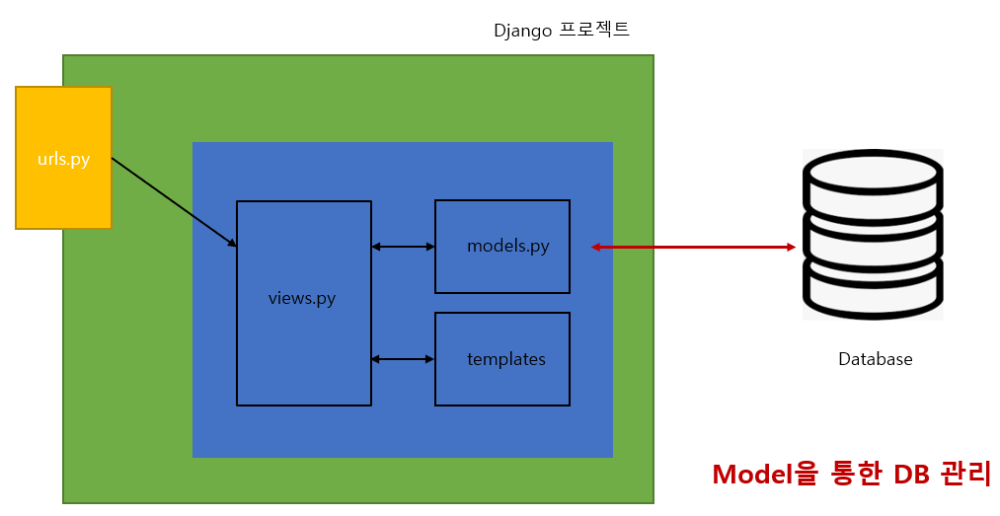
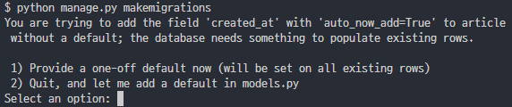
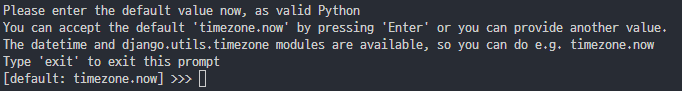
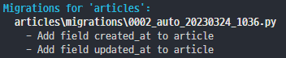

# 개요



<br>

# Model

## django Model
- DB의 테이블을 정의하고 데이터를 조작할 수 있는 기능들을 제공
- 테이블 구조를 설계하는 **'청사진(blueprint)'**

## model 클래스 작성
```python
class Article(models.Model):
    # 필드 이름(변수명) / 데이터 타입(모델 필드 클래스) / 제약조건(모델 필드 클래스의 키워드 인자)
    # id 필드는 자동 생성
    title = models.CharField(max_length=10) # 제약조건 필요
    content = models.TextField() # 제약조건 X
```

### model 클래스 이해하기(1)

- 이런 테이블을 만들기 위한 설계도
    - '모델 클래스 == 테이블 스키마'

        | id | title | content |
        |:---:|:---:|:---:|
        | ... | ... | ... |
        | ... | ... | ... |

### model 클래스 이해하기(2)

```python
class Article(models.Model):
    title = models.CharField(max_length=10)
    content = models.TextField()
```

- models 모듈의 Model이라는 부모 클래스를 상속 받아 작성
- model 기능에 관련된 설정이 담긴 클래스
    - https://github.com/django/django/blob/main/django/db/models/base.py

### model 클래스 이해하기(3)

```python
class Article(models.Model):
    title = models.CharField(max_length=10)
    content = models.TextField()
```

- 클래스 변수명
    - 테이블의 각 '필드 이름'
    - title
    - content

### model 클래스 이해하기(4)

```python
class Article(models.Model):
    title = models.CharField(max_length=10)
    content = models.TextField()
```

- model Field 클래스
    - 테이블 필드의 '데이터 타입'
    - CharField
    - TextField
    - https://docs.djangoproject.com/en/3.2/ref/models/fields/

### model 클래스 이해하기(5)

```python
class Article(models.Model):
    title = models.CharField(max_length=10)
    content = models.TextField()
```

- model Field 클래스의 키워드 인자 (필드 옵션)
    - 테이블 필드의 '제약 조건' 관련 설정
    - max_length=10
    - https://docs.djangoproject.com/en/3.2/ref/models/fields/

## 테이블 필드 데이터 타입

### 1. CharField()
- 길이의 제한이 있는 문자열을 넣을 때 사용
- 필드의 최대 길이를 결정하는 max_length는 필수 인자

### 2. TextField()
- 글자의 수가 많을 때 사용

### DateTimeField()
- 날짜와 시간을 넣을 때 사용
- DateTimeField의 선택인자
    - auto_now : 데이터가 저장될 때마다 자동으로 현재 날짜시간을 저장
    - auto_now_add : 데이터가 처음 생성될 때만 자동으로 현재 날짜시간을 저장

<br>

# Migrations
    model 클래스의 변경사항 (필드 생성, 추가, 수정 등)을 DB에 최종 반영하는 방법

## Migrations 과정
- model class **-(makemigrations)->** 0001_initial.py **-(migrate)->** db.sqlite3

### 1. model class (설계도 초안)
```python
class Article(models.Model):
    title = models.CharField(max_length=10)
    content = models.TextField()
```

### 2. migration 파일 (최종 설계도)
- 앱 폴더 -> migrations 폴더 -> 0001_initial.py 파일 확인
- 단, 0001_initial.py은 확인만 하는 용도(수정X!!)

### 3. db.sqlite3 파일
- migrate 후 db.sqlite3 파일 들어가 DB 내에 생성된 테이블 확인

## Migrations 핵심 명령어

```python
# 1. model class를 기반으로 설계도(migration) 작성
$ python manage.py makemigrations

# 2. 만들어진 설계도를 DB에 전달하여 반영
$ python manage.py migrate
```

## 이미 만들어진 테이블에 필드 추가

| id | title | content | created_at | updated_at |
|:---:|:---:|:---:|:---:|:---:|
| ... | ... | ... | ... | ... |
| ... | ... | ... | ... | ... |

### 추가 모델 필드 작성(1)

```python
class Article(models.Model):
    title = models.CharField(max_length=10)
    content = models.TextField()
    created_at = models.DateTimeField(auto_now_add=True)
    updated_at = models.DateTimeField(auto_now=True)
```

### 추가 모델 필드 작성(2)

```python
$ python manage.py makemigrations
```


- 이미 기존 테이블이 존재하기 때문에 필드를 추가 할 때 필드의 기본 값 설정 필요
- 1번 : 직접 기본 값을 입력하는 방법
- 2번 : 현재 대화에서 나간 후 models.py에 기본 값 관련 설정을 하는 방법

### 추가 모델 필드 작성(3)



- 추가하는 필드의 기본 값을 입력해야 하는 상황
- 날짜 데이터이기 때문에 직접 입력하기 보단 django가 제안하는 기본 값을 사용하는 것을 권장
- 아무것도 입력하지 않고 enter를 누르면 django가 제안하는 기본 값으로 설정됨(timezone.now)

### 추가 모델 필드 작성(4)



- migrations 과정 종료 후, 2번째 migration 파일이 생성됨을 확인
    - 0002_auto_...
- 이처럼 django는 설계도를 쌓아두면서 추후 문제가 발생했을 시, 복구용으로 사용할 수 있도록 함(like 'git commit')

### 추가 모델 필드 작성(5)
```python
$ python manage.py migrate
```

- migrate 후 필드가 추가 되었는지 확인

### - model class에 변경사항이 생겼다면, 반드시 새로운 설계도를 생성하고, 이를 DB에 반영해야 한다.
- 1. model class 작성 및 수정 -> 2. makemigrations -> 3. migrate

<br>

# Admin site

## Automatic admin interface
- django는 추가 설치 및 설정 없이 자동으로 관리자 인터페이스를 제공
- **데이터 관련 테스트 및 확인을 하기에 매우 유용**

## admin 계정 생성

```python
$ python manage.py createsuperuser
```

- **email은 선택사항이기 때문에 입력하지 않고 진행 가능**
- **비밀번호 생성 시, 보안상 터미널에 출력되지 않음** 
- 명령어 입력 후, DB에 생성된 admin 계정 확인(auth_user에서 확인 가능)

## admin에 모델 클래스 등록
```python
from django.contrib import admin
from .models import Article

admin.site.register(Article)
```

- **admin.py에 등록하지 않으면 admin site에서 확인 불가능**

---

<br>

# 참고

## 데이터베이스 초기화
1. migration 파일(0001, 0002로 시작하는 파일) 삭제
2. db.sqlite3 파일 삭제
3. **migrations 폴더를 지우지 않도록 주의!!**

## Migrations 기타 명령어
```python
$ python manage.py showmigrations
```

- migrations 파일들이 migrate 됐는지 안됐는지 여부 확인
- [X] 표시가 있으면 migrate가 완료되었음을 의미

<br>

```python
$ python manage.py sqlmigrate articles 0001
```
- 해당 migrations 파일이 SQL 문으로 어떻게 해석되어 DB에 전달되는지 확인하는 용도

## 첫 migrate 시 출력 내용이 많은 이유는?
- 기본적으로 django 프로젝트가 동작하기 위해 작성 되어있는 기본 내장 app들에 대한<br>
migration 파일들이 함께 migrate 되기 때문