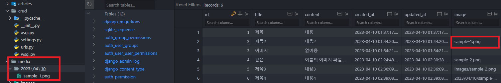
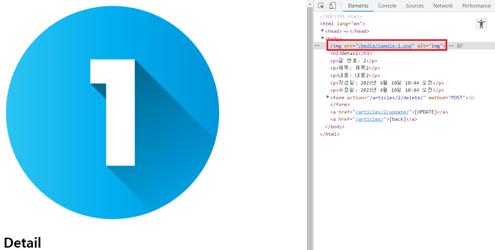
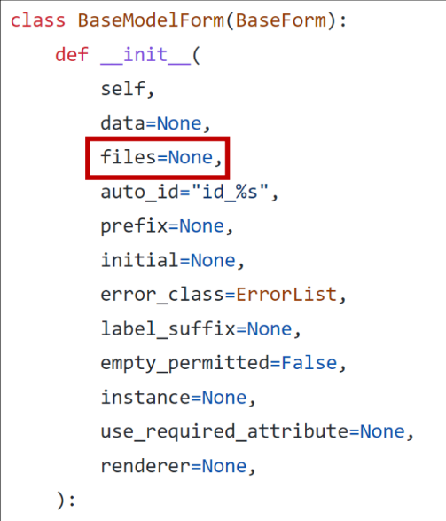

# Static Files
    - 서버 측에서 변경되지 않고 고정적으로 제공되는 파일
    - 이미지, JS, CSS 파일 등

## 웹 서버와 정적 파일


- 웹 서버의 기본 동작
    - 특정 위치(url)에 있는 자원을 요청(HTTP request) 받아서
    - 응답(HTTP response)을 처리하고 제공(serving)하는 것
    - 이는 "자원에 접근 가능한 주소가 있다."라는 의미
    - 웹 서버는 오청 받은 url로 서버에 존재하는 정적 자원(static resource)을 제공함
    - **결국, 정적 파일을 제공하기 위한 경로(url)가 있어야 함**

## 경로에 따른 Static File 제공하기
- 기본 경로
    - app/static
- 추가 경로
    - STATICFILES_DIRS

### STATIC_URL
- 기본 경로 및 추가 경로에 위치한 정적 파일을 참조하기 위한 url
- 실제 파일이나 디렉토리가 아니며, url로만 존재
- **비어 있지 않은 값으로 설정 한다면 반드시 slash(/)로 끝나야 함**

### 기본 경로 static File 제공하기
- articles/atatic/articles/ 경로에 이미지 파일 배치
- static tag를 사용해 이미지 파일에 대한 url 제공

```python
# settings.py

# 기본 경로
STATIC_URL = '/static/'
```
```html
<!-- articles/index.html -->




```

### 추가 경로 static File 제공하기
- 추가 경로에 이미지 파일 배치

```python
# settings.py

# 추가 경로

# 정적 파일의 기본 경로 외에 추가적인 경로 목록을 정의하는 리스트
STATICFILES_DIRS = [ 
    BASE_DIR / 'static',
]
```
```html
<!-- articles/index.html -->




```


#### URL + STATIC_URL + 정적파일 경로
- URL = http://127.0.0.1:8000/
- STATIC_URL = static/
- 정적파일 경로 = articles/sample-1.png

## Media Files
- 사용자가 웹에서 업로드하는 정적 파일 (user-uploaded)

### ImageField()
- 이미지 업로드에 사용하는 모델 필드
- **이미지 객체가 직접 저장되는 것이 아닌 '이미지 파일의 경로 문자열'이 DB에 저장**

### MEDIA_ROOT
- 미디어 파일들이 위치하는 디렉토리의 절대 경로

```python
# settings.py

MEDIA_ROOT = BASE_DIR / 'media' # 물리적인 위치
```

### MEDIA_URL
- MEDIA_ROOT에서 제공되는 미디어 파일에 대한 주소를 생성
- STATIC_URL과 동일한 역할

```python
# settings.py

MEDIA_URL = '/media/' # media 끝에 (/) 반드시 필요, url 주소를 제공
```

### MEDIA_ROOT와 MEDIA_URL에 대한 url 지정
```python
# crud/urls.py

from django.conf import settings
from django.conf.urls.static import static

urlpatterns = [
    path('admin/', admin.site.urls),
    path('articles/', include('articles.urls')),
] + static(settings.MEDIA_URL, document_root=settings.MEDIA_ROOT) # ,를 기준으로 앞쪽은 url, 뒤쪽은 물리적인 위치를 의미함
```
- 업로드 된 파일의 URL == settings.MEDIA_URL
- 위 URL을 통해 참조하는 파일의 실제 위치 == settings.MEDIA_ROOT

## 이미지 업로드 및 제공하기

### 이미지 업로드 (1/5)
- blank=True 속성을 작성해 빈 문자열이 저장될 수 있도록 설정

```python
# articles/models.py

class Article(models.Model):
    title = models.CharField(max_length=10)
    content = models.TextField()
    # 기존 필드 사이에 작성해도 실제 테이블 생성시, 가장 우측(뒤)에 추가됨
    image = models.ImageField(blank=True)
    created_at = models.DateTimeField(auto_now_add=True)
    updated_at = models.DateTimeField(auto_now=True)
```

### 이미지 업로드 (2/5)
- migration 진행
- **ImageField를 사용하려면 반드시 Pillow 라이브러리 필요**

```
$ pip install pillow

$ python manage.py makemigrations
$ python manage.py migrate

$ pip freeze > requirements.txt
```

### 이미지 업로드 (3/5)
- form 요소의 enctype 속성 추가

```html
<!-- articles/create.html -->

<h1>Create</h1>
<form action="" method="POST" enctype="multipart/form-data">
  
  {{ form.as_p }}
  <input type="submit">
</form>
```

### 이미지 업로드 (4/5)
- view 함수에서 업로드 파일에 대한 추가 코드 작성

```python
# articles/views.py

def create(request):
    if request.method == 'POST':
        print(request.FILES)
        form = ArticleForm(request.POST, request.FILES) # request.FILES 추가 작성
        if form.is_valid():
            article = form.save()
            return redirect('articles:detail', article.pk)
    else:
        form = ArticleForm()
    context = {
        'form': form,
    }
    return render(request, 'articles/create.html', context)
```

### 이미지 업로드 (5/5)
- 이미지 업로드 결과



### 업로드 이미지 제공하기 (1/3)
- url 속성을 통해 업로드 파일의 경로 값을 얻을 수 있음

    ```html
    <!-- articles/detail.html -->

    
    ```
- article.image.url - 업로드 파일의 경로
- article.image - 업로드 파일의 파일 이름

### 업로드 이미지 제공하기 (2/3)
- 업로드 출력 확인 및 MEDIA_URL 확인



### 업로드 이미지 제공하기 (3/3)
- 이미지를 업로드하지 않은 게시물은 detail 템플릿을 출력할 수 없는 문제 해결
- 이미지 데이터가 있는 경우만 이미지를 출력할 수 있도록 처리

```html
<!-- articles/detail.html -->


  

```

### 업로드 이미지 수정 (1/2)
- 수정 페이지 form 요소에 enctype 속성 추가

```html
<!-- articles/update.html -->

<h1>Update</h1>
<form action="" method="POST" enctype="multipart/form-data">
  
  {{ form.as_p }}
  <input type="submit" value="UPDATE">
</form>
```

### 업로드 이미지 수정 (2/2)
- view 함수에서 업로드 파일에 대한 추가 코드 작성

```python
# articles/views.py

def update(request, article_pk):
    article = Article.objects.get(pk=article_pk)
    if request.method == 'POST':
        # request.FILES, instance=article 추가로 작성
        form = ArticleForm(request.POST, request.FILES, instance=article)
        if form.is_valid():
            form.save()
            return redirect('articles:detail', article.pk)
    else:
        form = ArticleForm(instance=article)
    context = {
        'article': article,
        'form': form,
    }
    return render(request, 'articles/update.html', context)
```

---

<hr>

## 참고

### 'upload_to' argument
- ImageField()의 upload_to 인자를 사용해 미디어 파일 추가 경로 설정

```python
# 1
image = models.ImageField(blank=True, upload_to='images/')

# 2
image = models.ImageField(blank=True, upload_to='%Y/%m/%d')

# 3
def articles_image_path(instance, filename):
    return f'images/{instance.user.username}/{filename}'

image = models.ImageField(blank=True, upload_to='articles_image_path')
```

### request.FILES가 두 번째 위치 인자인 이유
- ModelForm 상의 클래스의 생성자 함수 참고

