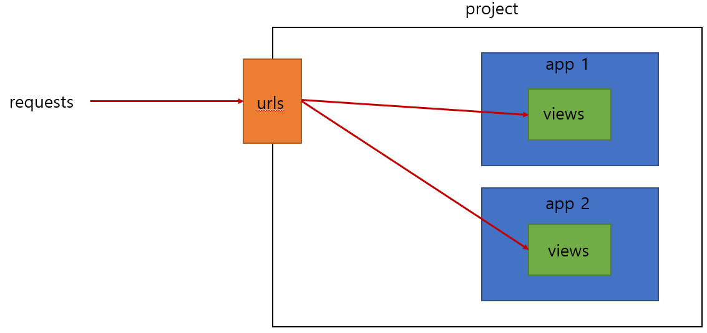

# URLs

## 1. URL dispatcher
    URL 패턴을 정의하고, 해당 패턴이 일치하는 요청을 처리할 view 함수을 연결(매핑)

## 2. 변수와 URL
- 템플릿의 많은 부분이 중복되고, url의 일부만 변경되는 상황이라면?

```python
urlpatterns = [
    path('articles/1/', ...),
    path('articles/2/', ...),
    path('articles/3/', ...),
    path('articles/4/', ...),
    path('articles/5/', ...),
]
```

## Variable Routing
- URL 일부에 변수를 포함시키는 것
- 변수는 view 함수의 인자로 전달할 수 있음

### Variable Routing 작성법
```python
# <path_converter:variable_name>

path('articles/<int:num>/', views.hello)
path('hello/<str:name>/', views.greeting)
# str은 기본값이라 생략 가능하지만, 명시적으로 적는게 좋음
```

## Path converters
- URL 변수의 타입을 지정
- str, int 등 5가지 타입 지원

## 3. App의 URL
<br>

## App URL mapping
- 각 앱에 URL을 정의하는 것
- 프로젝트와 각각의 앱이 URL을 나누어 관리하여 주소 관리를 편하게 하기 위함

### 기존



### 변경


## include()
- 다른 URL들을 참조할 수 있도록 돕는 함수

```python
from django.contrib import admin
from django.urls import path, include

urlpatterns = [
    path('admin/', admin.site.urls),
    path('articles/', include('articles.urls')),
    path('pages/', include('pages.urls')),
]
```

## 4. URL 이름 지정

### 기존 'articles/' 주소가 'articles/index/'로 변경됨
```python
path('articles/', include('articles.urls'))
```
```python
path('index/', views.index, name='index')
```
- 기존에 articles/ 주소를 사용했던 모든 위치를 찾아 변경해야 함

## Naming URL patterns
- URL에 이름을 지정하는 것
- path 함수의 name 인자를 정의해서 사용

### name 인자 작성
```python
from django.urls import path
from . import views
# from . => 명시적 상대경로 (django 권장사항)
# import views만 써도 무방함

urlpatterns = [
    path('index/', views.index, name='index'),
    path('dinner/', views.dinner, name='dinner'),
    path('search/', views.search, name='search'),
    path('throw/', views.throw, name='throw'),
    path('catch/', views.catch,  name='catch'),
    path('<int:num>/', views.detail,  name='detail'),
    path('hello/<str:name>/', views.greeting,  name='greeting'),
]
```
```python
from django.urls import path
from . import views

urlpatterns = [
    path('index/', views.index, name='index'),
]
```

### URL 표기 변화
```python



  <h1>Hello, {{ name }}!!</h1>
  <a href="'/dinner/'">dinner</a>
  <a href="'/search/'">search</a>
  <a href="'/throw/'">throw</a>
  <a href="'/index/'">두번째 앱의 메인 페이지로!</a>

```
```python



  <h1>Hello, {{ name }}!!</h1>
  <a href="">dinner</a>
  <a href="">search</a>
  <a href="">throw</a>
  <a href="">두번째 앱의 메인 페이지로!</a>

```
- **href 속성 값 뿐만 아니라, form의 action 속성 처럼 url을 작성하는 모든 위치에서 변경**

## 'url' tag
- 주어진 URL 패턴의 이름과 일치하는 절대 경로 주소를 반환

```python

# arg1과 arg2 구분할 때 콤마(,) 사용 X
```

## 5. URL Namespace

### URL 이름 지정 후 남은 문제
- 앱이 2개 이상일 때, url의 이름이 동일한 경우, 분리하기 어려움

```python
# articles/urls.py
path('index/', views.index, name='index')

# pages/urls.py
path('index/', views.index, name='index')
```

## app_name 속성 지정
- 위와 같이 url의 이름이 동일하여 분리하기 어려울 때
- url 이름 + app 이름표 붙이기

```python
# articles/urls.py
app_name = 'articles'
urlpatterns = [
    ...,
]
```
```python
# articles/urls.py
app_name = 'pages'
urlpatterns = [
    ...,
]
```

### URL tag의 변화
```python

```
```python


```

---

<br>

# 참고
## app_name 지정 후 주의사항
- app_name을 지정한 이후에는 url 태그에서 반드시 app_name:url_name 형태로만 사용 가능
- 그렇지 않으면, NoReverseMatch 에러 발생
- NoReverseMatch 발생 시, **urls.py에서 오류 발생한 것(url.py 집중해서 볼 것!)**
- app_name 지정 후 다음과 같은 표기는 사용 불가

    ```python
    
    ```

## Trailing Slashes
- django는 URL 끝에 '/'가 없으면 자동으로 붙임
- django의 url 설계 철학
    - "기술적인 측면에서, foo.com/bar와 foo.com/bar/는 서로 다른 URL이다."
- 검색 엔진 로봇이나 웹 트래픽 분석 도구에서는 이 두 주소를 서로 다른 페이지로 봄
- 그래서 django는 검색 엔진이 혼동하지 않게 하기 위해 사용
- 그러나 모든 프레임워크가 이렇게 동작하는 것은 아님